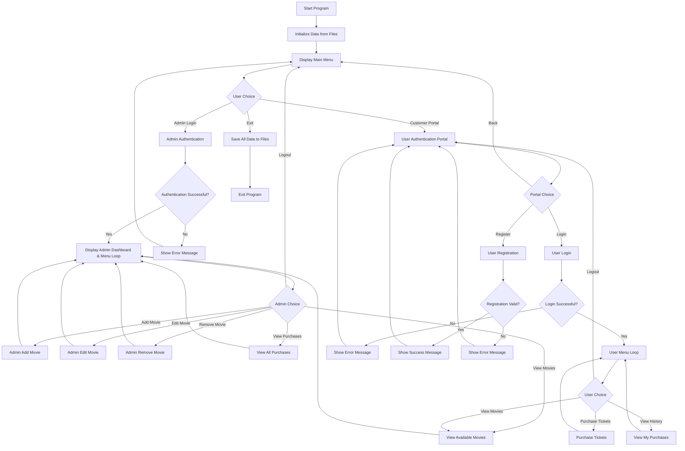

---

# JHS-CinePlex Documentation
## JHS-CinePlex Movie Ticket Booking System

## Table of Contents

- [Project Overview](#project-overview)
- [System Architecture](#system-architecture)
- [Data Structures](#data-structures)
- [Function Documentation](#function-documentation)
- [Program Flowcharts](#program-flowcharts)
- [File I/O and Data Persistence](#file-io-and-data-persistence)
- [Navigating the System: Screen by Screen](#navigating-the-system-screen-by-screen)
- [Limitations and Future Improvements](#limitations-and-future-improvements)
- [Conclusion](#conclusion)

## Project Overview
### Introduction

JHS-CinePlex is a Command Line Interface (CLI)-based movie ticket booking system developed in C. This system provides a complete solution for basic cinema management, allowing administrators to manage movies and showtimes while customers can browse available movies, purchase tickets, and view their purchase history. It features a visually enhanced interface with ANSI color codes, formatted tables, and an administrative dashboard for a professional and user-friendly experience.

### System Objectives

- To provide a user-friendly and visually appealing interface for both administrators and customers.
- To enable efficient movie management (add, edit, remove).
- To facilitate secure user authentication and registration for customers.
- To streamline the ticket purchasing process and generate a clear on-screen ticket.
- To maintain persistent data storage for movies, users, and transactions using local text files.
- To provide administrators with a dashboard to track key metrics like revenue and tickets sold.

### Key Features

- **Dual Role System:** Separate interfaces for Administrators and Customers with distinct functionalities.
- **Admin Dashboard:** A summary view for administrators showing total movies, tickets sold, and total revenue.
- **User Management:** Robust registration and login functionality for customers.
- **Movie Management (CRUD):**
    - **Add:** Add new movies with title, genre, showtime, price, and available seats.
    - **Edit:** Select a movie from a list to update its details.
    - **Remove:** Select a movie from a list to delete it from the system.
- **Enhanced Visual Interface:** Features styled headers and color-coded feedback (success, error, info) for improved readability.
- **Ticket Booking:** Customers can browse movies, check seat availability (color-coded), purchase tickets, and receive a formatted on-screen e-ticket.
- **Purchase History:** Track individual and system-wide purchases in a clean, tabular format.
- **Data Persistence:** Automatically saves and loads all data (movies, users, purchases) from text files at the start and end of the session.
- **Default Data:** Pre-populated with a list of sample movies if no data file is found, ensuring the application is ready for immediate demonstration.

### Technology Stack

- **Language:** C (Standard C)
- **Platform:** Primarily designed for Windows (`system("cls")`) but easily adaptable for Linux/macOS.
- **Data Storage:** Flat text files (`movie_list.txt`, `tickets.txt`, `users.txt`).
- **Libraries:** Standard C libraries (`stdio.h`, `stdlib.h`, `string.h`, `ctype.h`, `time.h`).

## System Architecture
### Overall System Design

The system is built within a single C file but follows a logical, modular architecture with a clear separation of concerns.

### Module Breakdown
1.  **Main Module (`main`)**
    - The entry point of the application.
    - Initializes data by calling `Read_...` functions.
    - Handles the main menu navigation (Admin, Customer, Exit).
    - Coordinates program termination and saves all data by calling `Write_...` functions.

2.  **Administrator Module**
    - Handles authentication for admin users (using hardcoded credentials).
    - Displays an overview dashboard with key statistics.
    - Provides access to movie management operations (add, edit, remove).
    - Allows viewing of a comprehensive purchase report.

3.  **User Module**
    - Manages customer authentication (login) and registration.
    - Allows users to browse movies, purchase tickets, and view their personal purchase history.

4.  **Data Persistence Module**
    - Contains all file I/O operations for reading from and writing to text files.
    - Manages data serialization and deserialization for all data structures.
    - Includes logic for initializing default data if the primary movie file is missing.

5.  **UI/Utility Module**
    - Contains helper functions for enhancing the user experience, such as `press_enter_to_continue()`.
    - Defines ANSI color codes for a styled console output.

## Data Structures
### Core Data Structures
#### 1. Movie Structure
```c
struct Movie {
    char title[200];
    char genre[100];
};
```
**Purpose:** Stores basic movie information, including its title and genre.

#### 2. Showtime Structure
```c
struct Showtime {
    char time[100];
    int price;
    int available_Seats;
};
```
**Purpose:** Manages scheduling details, ticket price, and seat availability for a movie.

#### 3. Ticket Structure
```c
struct Ticket {
    char movie_Title[200];
    char show_Time[50];
    int ticket_Count;
    int total_Amount;
    char username[50];
    char purchase_Date[20];
};
```
**Purpose:** Records a single ticket purchase with complete transaction details, including the purchaser's username and the date of the transaction.

#### 4. User Structure
```c
struct User {
    char username[50];
    char password[50];
};
```
**Purpose:** Stores the authentication credentials (username and password) for a customer account.

### Global Variables
#### Data Arrays & Constants
```c
#define MAX_MOVIES 200
#define MAX_PURCHASES 500
#define MAX_USERS 200

struct Movie m[MAX_MOVIES];
struct Showtime s[MAX_MOVIES];
struct Ticket all_purchases[MAX_PURCHASES];
struct User all_users[MAX_USERS];
```

#### Counters
```c
int movie_count = 0;
int purchase_count = 0;
int user_count = 0;
```

### Data Relationships
The system relies on a parallel array structure where the index `i` correlates related data across different arrays:
- `m[i]` (movie details) and `s[i]` (showtime details) together represent a single, complete movie listing.
- `all_purchases[]` is an independent array that logs all transactions.
- `all_users[]` is an independent array that stores all registered customer accounts.

## Function Documentation
### Main Function
#### `main()`
- **Purpose:** Serves as the entry point and main control loop of the application.
- **Functionality:** Initializes the system by reading data from files, displays the main menu, routes the user to either the admin or user portals, and ensures all data is saved to files before exiting.

### Administrator Functions
#### `admin_panel()`
- **Purpose:** Manages administrator authentication and serves as the gateway to the admin menu.
- **Functionality:** Prompts for admin credentials. If valid (matches hardcoded values), it enters a loop displaying the admin dashboard and menu, dispatching to other admin functions based on user choice.

#### `admin_add_movie()`
- **Purpose:** Adds a new movie and its showtime details to the system.
- **Functionality:** Prompts the admin for all movie details (title, genre, showtime, price, seats), adds the new data to the `m` and `s` arrays, increments `movie_count`, and writes the updated movie list to the file.

#### `admin_edit_movie()`
- **Purpose:** Allows an administrator to modify the details of an existing movie.
- **Functionality:** Lists all current movies with a number. The admin selects a movie by its number, and is then prompted to enter new values for each field (or press Enter to keep the current value).

#### `admin_remove_movie()`
- **Purpose:** Removes a movie listing from the system.
- **Functionality:** Lists all movies with a number. The admin selects a movie to remove, confirms the action, and the movie is deleted by shifting subsequent elements in the arrays.

#### `view_all_purchases()`
- **Purpose:** Displays a complete, system-wide history of all ticket purchases.
- **Functionality:** Iterates through the `all_purchases` array and displays all transactions in a formatted table, including date, movie title, ticket count, amount, and the user who made the purchase.

### User Functions
#### `user_portal()`
- **Purpose:** Acts as the main entry point for all customers.
- **Functionality:** Displays a menu with options to **Login** to an existing account, **Register** a new account, or go **Back** to the main menu.

#### `user_login(char* username_buffer)`
- **Purpose:** Authenticates a customer's login credentials.
- **Functionality:** Prompts for a username and password, then iterates through the `all_users` array to find a match.
- **Returns:** `int` (1 for a successful login, 0 for failure). Populates `username_buffer` on success.

#### `user_register()`
- **Purpose:** Allows a new customer to create an account.
- **Functionality:** Prompts for a new username and password, checks the `all_users` array to ensure the username is not already taken, and then saves the new user account.

#### `user_menu(const char* username)`
- **Purpose:** Displays the main menu for a logged-in customer.
- **Functionality:** Welcomes the user by name and provides options to View Movies, Purchase Tickets, View My Purchases, or Logout.

#### `view_available_movies()`
- **Purpose:** Displays all movies currently available for booking.
- **Functionality:** Shows a formatted table of all movies, including title, genre, price, and seat availability. The seat count is color-coded for at-a-glance status (Green for available, Yellow for few seats left, Red for sold out).

#### `purchase_tickets(const char* username)`
- **Purpose:** Guides a customer through the multi-step process of buying tickets.
- **Functionality:** Lists movies for selection, validates the requested number of tickets against availability, shows a purchase summary for confirmation, processes the transaction (updating seat counts and creating a ticket record), and prints a formatted e-ticket to the console.

#### `view_my_purchases(const char* username)`
- **Purpose:** Displays the personal purchase history for the currently logged-in user.
- **Functionality:** Filters the global `all_purchases` array by the current user's username and displays their transaction history along with a total amount spent.

### Data Persistence Functions
#### `Read_Movies()`, `Write_Movies()`
- **Purpose:** Load/save movie and showtime data from/to `movie_list.txt`.
- **Functionality:** `Read_Movies()` is called at startup. If `movie_list.txt` is missing, it calls `Default_Movies()` to populate the system with sample data and then creates the file. `Write_Movies()` saves the current state of the movie arrays to the file.

#### `Read_Tickets()`, `Write_Tickets()`
- **Purpose:** Load/save all ticket purchase data from/to `tickets.txt`.

#### `Read_Users()`, `Write_Users()`
- **Purpose:** Load/save all customer account data from/to `users.txt`.

#### `Default_Movies()`
- **Purpose:** Populates the system with five default movies if `movie_list.txt` is not found on startup.

### Utility Functions
#### `press_enter_to_continue()`
- **Purpose:** Pauses the program execution until the user presses the Enter key.
- **Functionality:** Prints a prompt and uses `getchar()` to wait for input, allowing users to read information on screen before it is cleared.

## Program Flowcharts

### 1. Main Program Flow
This chart illustrates the high-level structure of the application.

---

## File I/O and Data Persistence

The system's state is preserved across sessions using three separate text files. Data is loaded into memory at startup and written back to the files upon any change and before the program exits.

#### 1. `movie_list.txt`
- **Format:** 5 lines per movie entry.
- **Content:**
  1.  Title
  2.  Genre
  3.  Showtime
  4.  Price
  5.  Available Seats

#### 2. `tickets.txt`
- **Format:** 6 lines per purchase entry.
- **Content:**
  1.  Movie Title
  2.  Showtime
  3.  Ticket Count
  4.  Total Amount
  5.  Username
  6.  Purchase Date (YYYY-MM-DD)

#### 3. `users.txt`
- **Format:** 1 line per user entry.
- **Content:** `username password` (space-separated).

### Data Integrity Measures
- **Automatic File Creation:** The system checks for the existence of `movie_list.txt` on startup. If the file is not found, the `Default_Movies()` function is called to populate the application with sample data, and the file is then created. This ensures the application is always functional, even on its first run.
- **Safe I/O:** `fgets` is used for reading lines from files to prevent buffer overflows. Data is parsed from these lines using `atoi` and `sscanf`.
- **Data Synchronization:** Data is written back to files immediately after a state-changing operation (e.g., adding a movie, purchasing a ticket) and again as a final step before the program exits, minimizing the risk of data loss.

---

## Development Environment and Execution Guide

This section provides a detailed guide on how to set up the development environment, compile, and run the JHS-CinePlex application using **Visual Studio Code**, the platform used for its development.

### IDE and Tools
- **Code Editor:** **Visual Studio Code (VS Code)**
- **Compiler:** **GCC (GNU Compiler Collection)**
- **Operating System:** Developed on Windows (using MinGW-w64), but the code is cross-platform compatible with minor adjustments.

### Prerequisites
Before you begin, ensure you have the following installed on your system:

1.  **Visual Studio Code:** Download and install it from the [official website](https://code.visualstudio.com/).

2.  **A C Compiler (GCC):**
    -   **On Windows:** Install **MinGW-w64** to get the GCC toolchain. You can follow the instructions on the [MSYS2 website](https://www.msys2.org/) or use a standalone installer. **Crucially, ensure you add the `bin` directory of your MinGW installation (e.g., `C:\msys64\mingw64\bin`) to your system's PATH environment variable.**
    -   **On Linux:** GCC is typically pre-installed. If not, you can install it using your distribution's package manager (e.g., `sudo apt-get install build-essential` on Debian/Ubuntu).
    -   **On macOS:** Install the **Xcode Command Line Tools** by running `xcode-select --install` in your terminal.

3.  **VS Code C/C++ Extension:** This is essential for C development in VS Code. Install it from the VS Code Marketplace.
    -   [C/C++ Extension Pack by Microsoft](https://marketplace.visualstudio.com/items?itemName=ms-vscode.cpptools-extension-pack)

### How to Compile and Run in VS Code

There are two primary ways to run the code: manually via the integrated terminal, or using VS Code's build and debug tasks for a one-click experience.

#### Method 1: Manual Compilation (Using the Integrated Terminal)

This is the most straightforward method and helps verify that your compiler is set up correctly.

1.  Open the project folder (the one containing `main.c`) in VS Code.
2.  Open the integrated terminal in VS Code by going to `Terminal > New Terminal` or pressing `` Ctrl+` ``.
3.  In the terminal, type the following command to compile the code:
    ```sh
    gcc main.c -o cineplex
    ```
    -   This command tells the `gcc` compiler to take `main.c` as input and create an executable file named `cineplex.exe` (on Windows) or `cineplex` (on Linux/macOS).
4.  Once the compilation is successful (no errors are shown), run the program by typing its name in the terminal:
    -   On Windows:
        ```sh
        .\cineplex.exe
        ```
    -   On Linux/macOS:
        ```sh
        ./cineplex
        ```
5.  If the build is successful, it will launch the compiled `cineplex` executable in the integrated terminal.

---

## Navigating the System: Screen by Screen

This section provides a walkthrough of the application's interface.

---
### 1. Main Menu
The application's entry point.
**Screen:**
```
====================== JHS-CinePlex - Management & Booking ======================

   [1] Admin Login
   [2] Customer Login / Register

   [3] Exit

>> Enter your choice: 
```

---
### 2. Admin Login
**Screen:**
```
================================== Admin Login ==================================

Enter Admin Username: Hasib
Enter Admin Password: hasib123
```
**Outcome:**
- **Success:** `[SUCCESS] Login successful.` is displayed, followed by the Admin Dashboard.
- **Failure:** `[ERROR] Incorrect username or password. Access denied.` is displayed.

---
### 3. Admin Dashboard and Menu
The central hub for all administrative tasks.
**Screen:**
```
================================ Admin Dashboard ================================

  Total Movies:   5         
  Tickets Sold:   0         
  Total Revenue:  BDT 0         

   [1] Add New Movie
   [2] Edit Movie
   [3] Remove Movie
   [4] View All Movies
   [5] View All Purchases

   [6] Logout

>> Enter your choice:
```

---
### 4. Admin: Edit Movie
**Screen:**
```
================================= ~ Edit Movie =================================

 Select a movie to edit:

    [1] Hereditary
    [2] The Notebook
    [3] Boss Baby
    [4] Harry Potter
    [5] Chander Pahar

    [0] Back

>> Enter movie number: 2
```
After selection:
```
Editing Movie: The Notebook (Romantic)

Current Showtime: 08:30 PM - 10:10 PM
Current Price: BDT 200
Current Seats: 10

[INFO] Press Enter to keep the current value for any field.

New Title: 
New Genre: 
New Showtime: 
New Price: 250
New Seats: 
```

---
### 5. Admin: Remove Movie
**Screen:**
```
=============================== [-] Remove Movie ===============================

 Select a movie to remove:

    [1] Hereditary
    [2] The Notebook
    ...

    [0] Back

>> Enter movie number: 3
```
After selection:
```
Selected Movie: Boss Baby (Comedy)
Confirm removal? This action cannot be undone. (Y/N): 
```

---
### 6. Customer Portal
The entry point for customers.
**Screen:**
```
================================ Customer Portal ================================

   [1] Login to your account
   [2] Register a new account

   [3] Back to Main Menu

>> Enter your choice: 
```

---
### 7. Customer Registration
**Screen:**
```
============================ New User Registration ============================

Enter a new username (0 to cancel): User1
Enter a new password: password123
```
- **Success:** `[SUCCESS] Registration successful! You can now log in...`
- **Failure:** `[ERROR] This username is already taken...`

---
### 8. Customer Menu
The dashboard for a logged-in customer.
**Screen:**
```
============================== Welcome, User1! ===============================

   [1] View Available Movies
   [2] Purchase Tickets
   [3] View My Purchase History

   [4] Logout

>> Enter your choice: 
```

---
### 9. Customer: View Available Movies
**Screen:**
```
=============================== Available Movies ================================

---------------------------------------------------------------------------------
No.  Title                          Genre                Price        Seats     
---------------------------------------------------------------------------------
1   Hereditary                     Horror               BDT 200    50        
2   The Notebook                   Romantic             BDT 200    10        
3   Boss Baby                      Comedy               BDT 200    50        
4   Harry Potter                   Fantasy              BDT 500    SOLD OUT  
---------------------------------------------------------------------------------
```

---
### 10. Customer: Purchase Tickets & Receipt
A multi-step process culminating in an e-ticket.
**Screen (Selection and Confirmation):**
```
=============================== Purchase Tickets ================================

   [1] Hereditary (Horror) - Seats: 50
   [2] The Notebook (Romantic) - Seats: 10
   ...
   [0] Back

>> Enter movie number to purchase: 2

Selected Movie: 'The Notebook' | Available Seats: 10
>> Enter number of tickets to buy: 2

--- Purchase Summary ---
   Movie:    The Notebook
   Showtime: 08:30 PM - 10:10 PM
   Tickets:  2
   Total:    BDT 400
------------------------

Confirm purchase? (Y/N): Y
```
**Screen (E-Ticket):**
```
      Purchase Successful! Here is your ticket:
 ----------------------------------------------- 
|            JHS-CinePlex E-Ticket              |
 ----------------------------------------------- 
 Movie: The Notebook                           
 Show : 08:30 PM - 10:10 PM                    
 Seats: 2                                      
 Total: BDT 400                                
 Date : 2024-05-21                             
 User : User1                             
 ----------------------------------------------- 
```

## Conclusion
The JHS-CinePlex project successfully implements a dual-role movie booking application in C, demonstrating a solid understanding of core programming concepts, data structures, file I/O, and modular design. It provides a functional and user-friendly CLI with a professional, color-coded interface and reliable data persistence. While there are clear limitations inherent in its simple design, the project serves as an excellent foundation. The outlined future improvements provide a clear roadmap for evolving it into a more scalable, secure, and feature-rich application.
