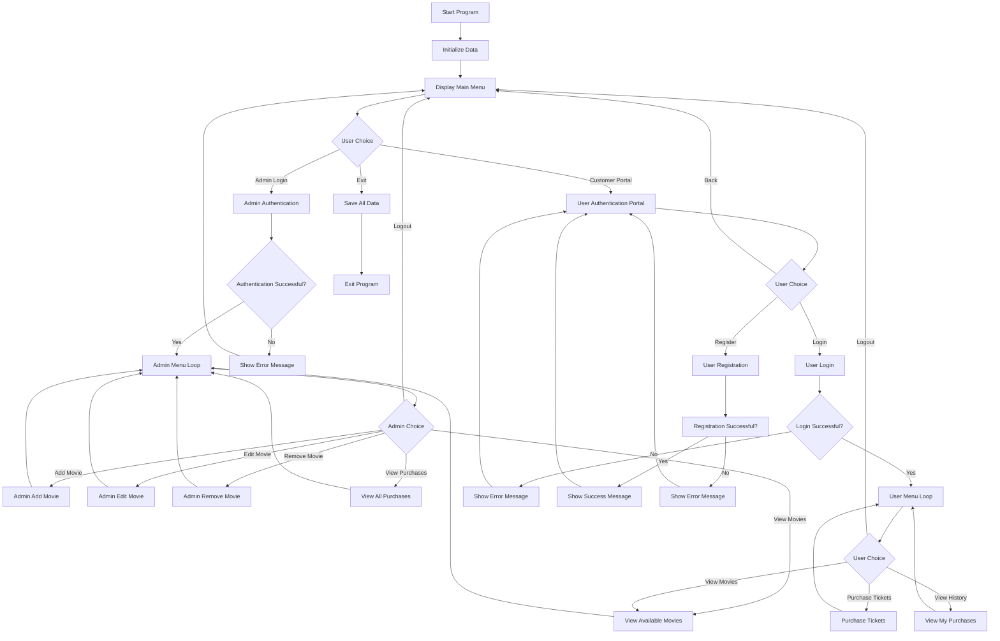
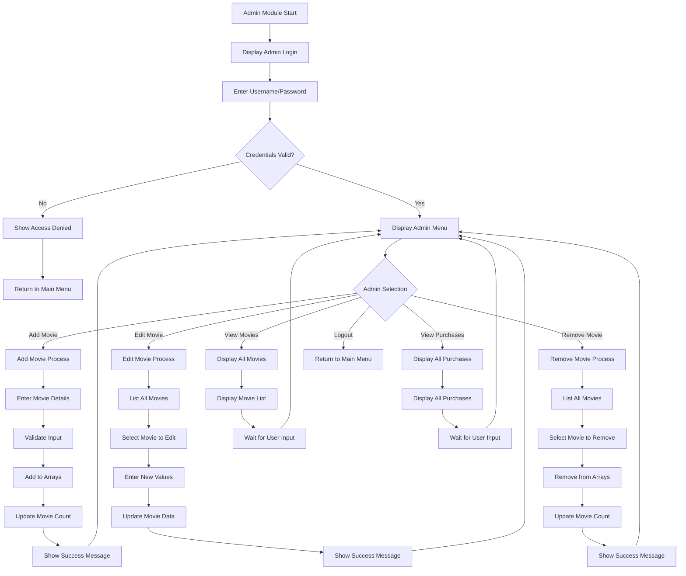
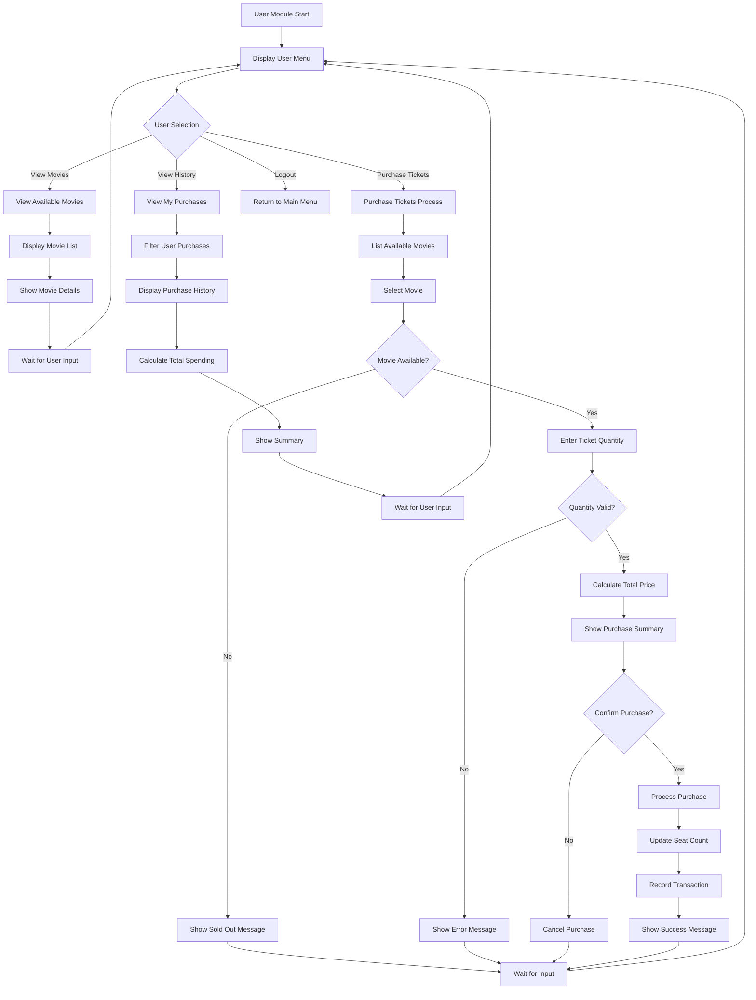
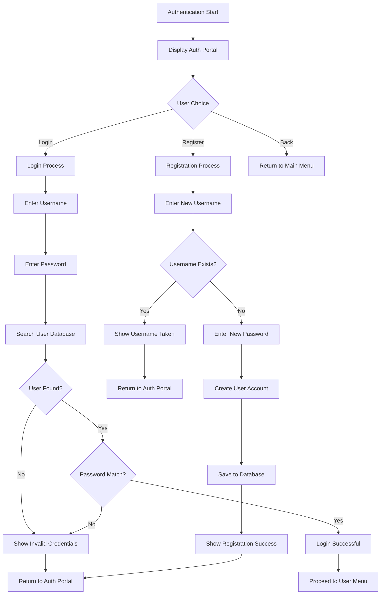
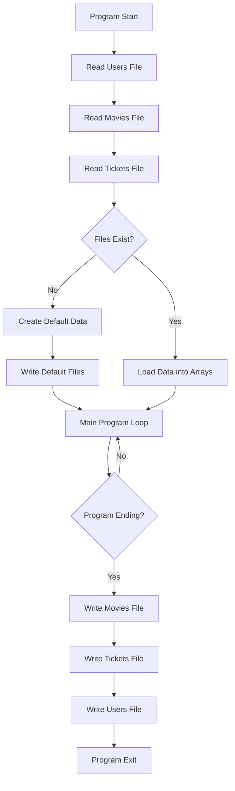

---

# JHS-CinePlex Documentation
## JHS-CinePlex Movie Ticket Booking System
### CSE115 Semester Final Project Documentation

## Table of Contents

- Project Overview
- System Architecture
- Data Structures
- Function Documentation
- Program Flowcharts
- File I/O and Data Persistence
- User Guide & Administrator Guide
- Navigating the System: Screen by Screen
- Limitations and Future Improvements
- Development Notes

## Project Overview
### Introduction

JHS-CinePlex is a comprehensive Command Line Interface (CLI)-based movie ticket booking system developed in C. This system provides a complete solution for cinema management, allowing administrators to manage movies and showtimes while customers can browse available movies, purchase tickets, and view their purchase history. It features a visually enhanced interface with colors and formatted tables for a professional and user-friendly experience.

### System Objectives

- Provide a user-friendly and visually appealing interface for both administrators and customers.
- Enable efficient movie management (add, edit, remove).
- Facilitate secure user authentication and registration.
- Streamline the ticket purchasing process.
- Maintain persistent data storage for movies, users, and transactions.
- Generate purchase reports and history tracking.

### Key Features

- **Dual Role System:** Administrator and Customer access levels.
- **User Management:** Registration and login functionality.
- **Movie Management:** Add, edit, remove movies with showtimes and pricing.
- **Enhanced Visual Interface:** Features styled headers, color-coded feedback, and aligned tables for improved readability.
- **Ticket Booking:** Browse movies and purchase tickets with seat availability tracking.
- **Purchase History:** Track individual and all purchases in a clean, tabular format.
- **Data Persistence:** Save and load data from text files.
- **Default Data:** Pre-populated with sample movies for demonstration.

### Technology Stack

- **Language:** C (ANSI C)
- **Platform:** Cross-platform (Windows/Linux/macOS)
- **Data Storage:** Text files (`movie_list.txt`, `tickets.txt`, `users.txt`)
- **Libraries:** Standard C libraries (`stdio.h`, `stdlib.h`, `string.h`, `ctype.h`, `time.h`)

## System Architecture
### Overall System Design

The system follows a modular architecture with clear separation of concerns:

### Module Breakdown
1.  **Main Module**
    - Entry point of the application.
    - Handles main menu navigation.
    - Coordinates between admin and user modules.
    - Manages program termination and data saving.

2.  **Administrator Module**
    - Authentication for admin users.
    - Movie management operations.
    - Purchase report generation.
    - System oversight capabilities.

3.  **User Module**
    - Customer authentication and registration.
    - Movie browsing and ticket purchasing.
    - Personal purchase history viewing.
    - User account management.

4.  **Data Persistence Module**
    - File I/O operations for all data types.
    - Data serialization and deserialization.
    - Default data initialization.
    - Error handling for file operations.

## Data Structures
### Core Data Structures
#### 1. Movie Structure
```c
struct Movie {
    char title[200];      // Movie title
    char genre[100];      // Movie genre/category
};
```
**Purpose:** Stores basic movie information including title and genre classification.

#### 2. Showtime Structure
```c
struct Showtime {
    char time[100];           // Showtime (e.g., "08:00 PM - 10:00 PM")
    int price;                // Ticket price in local currency
    int available_Seats;      // Number of available seats
};
```
**Purpose:** Manages scheduling and availability information for each movie.

#### 3. Ticket Structure
```c
struct Ticket {
    char movie_Title[200];    // Movie title for the ticket
    char show_Time[50];       // Showtime for the ticket
    int ticket_Count;         // Number of tickets purchased
    int total_Amount;         // Total amount paid
    char username[50];        // Username of purchaser
    char purchase_Date[20];   // Date of purchase (YYYY-MM-DD)
};
```
**Purpose:** Records individual ticket purchases with complete transaction details.

#### 4. User Structure
```c
struct User {
    char username[50];    // User's username
    char password[50];    // User's password (stored in plaintext)
};
```
**Purpose:** Stores user authentication credentials.

### Global Variables
#### Data Arrays
```c
struct Movie m[100];                    // Array of movies
struct Showtime s[100];                 // Array of showtimes
struct Ticket all_purchases[200];       // Array of all ticket purchases
struct User all_users[100];             // Array of registered users
```

#### Counters
```c
int movie_count = 0;        // Number of movies in system
int purchase_count = 0;      // Number of ticket purchases
int user_count = 0;          // Number of registered users
```

### Data Relationships
The system maintains parallel arrays where the index correlates related data:
- `m[i]` and `s[i]` represent the same movie's information and showtime details
- `all_purchases[i]` stores individual purchase records
- `all_users[i]` contains user account information

## Function Documentation
### Main Functions
#### `main()`
- **Purpose:** Entry point and main program loop
- **Parameters:** None
- **Returns:** `int` (0 on successful exit)
- **Functionality:**
    - Initializes data by reading from files
    - Displays main menu with options for admin login, user portal, or exit
    - Handles user input and routes to appropriate modules
    - Saves all data before program termination

#### `Admin()`
- **Purpose:** Administrator authentication and main menu
- **Parameters:** None
- **Returns:** `void`
- **Functionality:**
    - Prompts for admin username and password
    - Validates credentials against hardcoded admin accounts
    - Provides access to admin menu upon successful authentication
    - Handles admin operations loop

#### `User(char* current_username)`
- **Purpose:** Customer interface and menu system
- **Parameters:**
    - `current_username`: Pointer to username string of logged-in user
- **Returns:** `void`
- **Functionality:**
    - Displays user-specific menu with options
    - Handles movie browsing, ticket purchasing, and history viewing
    - Maintains user session until logout

### Authentication Functions
#### `User_Register()`
- **Purpose:** Registers new user accounts
- **Parameters:** None
- **Returns:** `void`
- **Functionality:**
    - Prompts for new username and password
    - Checks for duplicate usernames
    - Adds new user to system and saves to file
    - Provides feedback on registration status

#### `User_Login(char* username_buffer)`
- **Purpose:** Authenticates user credentials
- **Parameters:**
    - `username_buffer`: Buffer to store authenticated username
- **Returns:** `int` (1 for successful login, 0 for failure)
- **Functionality:**
    - Prompts for username and password
    - Validates against stored user credentials
    - Returns success/failure status

#### `User_Auth_Portal()`
- **Purpose:** User authentication entry point
- **Parameters:** None
- **Returns:** `void`
- **Functionality:**
    - Displays authentication options (login/register/back)
    - Routes to appropriate authentication function
    - Handles user session after successful authentication

### Administrator Functions
#### `Admin_Menu()`
- **Purpose:** Displays administrator menu options
- **Parameters:** None
- **Returns:** `void`
- **Functionality:**
    - Prints formatted admin menu with all available operations
    - Includes options for movie management and reporting

#### `Admin_Add_Movie()`
- **Purpose:** Adds new movie to the system
- **Parameters:** None
- **Returns:** `void`
- **Functionality:**
    - Prompts for movie details (title, genre, showtime, price, seats)
    - Validates input and adds to system
    - Updates movie count and provides feedback

#### `Admin_Edit_Movie()`
- **Purpose:** Modifies existing movie information
- **Parameters:** None
- **Returns:** `void`
- **Functionality:**
    - Lists all movies for selection
    - Allows editing of price and available seats
    - Updates movie information with validation

#### `Admin_Remove_Movie()`
- **Purpose:** Removes movie from the system
- **Parameters:** None
- **Returns:** `void`
- **Functionality:**
    - Lists all movies for selection
    - Removes selected movie and associated showtime
    - Maintains array integrity after removal

#### `View_All_Purchases()`
- **Purpose:** Displays all system purchase history
- **Parameters:** None
- **Returns:** `void`
- **Functionality:**
    - Shows all ticket purchases with details
    - Includes purchaser information and transaction dates
    - Provides comprehensive sales overview

### User Functions
#### `User_Menu(char* username)`
- **Purpose:** Displays user-specific menu options
- **Parameters:**
    - `username`: Current user's username
- **Returns:** `void`
- **Functionality:**
    - Prints personalized user menu
    - Includes options for browsing, purchasing, and history

#### `View_Available_Movies()`
- **Purpose:** Displays all available movies with details
- **Parameters:** None
- **Returns:** `void`
- **Functionality:**
    - Shows all movies with their information
    - Includes showtimes, prices, and seat availability
    - Highlights sold-out movies

#### `Purchase_Tickets(char* current_username)`
- **Purpose:** Handles ticket purchasing process
- **Parameters:**
    - `current_username`: Username of purchasing user
- **Returns:** `void`
- **Functionality:**
    - Lists available movies for selection
    - Handles ticket quantity input and validation
    - Processes payment confirmation and updates seat availability
    - Records purchase transaction with date stamp

#### `View_My_Purchases(char* current_username)`
- **Purpose:** Displays individual user's purchase history
- **Parameters:**
    - `current_username`: Username of user
- **Returns:** `void`
- **Functionality:**
    - Filters purchases by specific user
    - Shows detailed purchase history with totals
    - Calculates and displays total spending

### Data Persistence Functions
#### `Read_Movies() / Write_Movies()`
- **Purpose:** Load/save movie data from/to file
- **Parameters:** None
- **Returns:** `void`
- **Functionality:**
    - Handles serialization/deserialization of movie and showtime data
    - Creates default movies if file doesn't exist
    - Maintains data integrity across program sessions

#### `Read_Tickets() / Write_Tickets()`
- **Purpose:** Load/save ticket purchase data from/to file
- **Parameters:** None
- **Returns:** `void`
- **Functionality:**
    - Manages persistence of all ticket transactions
    - Handles complex data structure serialization
    - Ensures purchase history is maintained

#### `Read_Users() / Write_Users()`
- **Purpose:** Load/save user account data from/to file
- **Parameters:** None
- **Returns:** `void`
- **Functionality:**
    - Manages user credential persistence
    - Handles simple username/password storage
    - Maintains user database integrity

#### `Default_Movies()`
- **Purpose:** Initializes system with default movie data
- **Parameters:** None
- **Returns:** `void`
- **Functionality:**
    - Populates system with sample movies
    - Provides demonstration data for new installations
    - Includes various genres and showtimes

### Utility Functions

#### UI Helper Functions

##### `clear_screen()`
- **Purpose:** Clears the terminal screen in a cross-platform way.
- **Functionality:** Uses `system("cls")` on Windows and `system("clear")` on other systems (Linux, macOS).

##### `print_header(const char* title)`
- **Purpose:** Prints a standardized, centered, and colored header.
- **Functionality:** Takes a title string and prints it centered within a double-line border, using cyan color for emphasis.

##### `print_success(const char* message)`
- **Purpose:** Displays a formatted success message.
- **Functionality:** Prints the message in green, prefixed with `[SUCCESS]`.

##### `print_error(const char* message)`
- **Purpose:** Displays a formatted error message.
- **Functionality:** Prints the message in red, prefixed with `[ERROR]`.

##### `print_warning(const char* message)`
- **Purpose:** Displays a formatted informational or warning message.
- **Functionality:** Prints the message in yellow, prefixed with `[INFO]`.

#### Other Utility Functions

##### `Press_Enter_to_Continue()`
- **Purpose:** Pauses program execution until the user presses Enter.
- **Functionality:** Clears the input buffer and waits for an Enter key press, allowing users to read information before proceeding.

## Program Flowcharts

### Main Program Flow


### Administrator Module Flow


### User Module Flow


### Authentication Flow


### Data Persistence Flow


## File I/O and Data Persistence

### File Structure
The system uses three text files for data persistence:

#### 1. `movie_list.txt`
- **Format:** Each movie occupies 5 lines
    1.  Movie Title
    2.  Movie Genre
    3.  Showtime
    4.  Price
    5.  Available Seats

- **Example:**
```text
Hereditary
Horror
11:00 PM - 01:20 AM
200
50
The Notebook
Romantic
08:30 PM - 10:10 PM
200
10
```

#### 2. `tickets.txt`
- **Format:** Each ticket purchase occupies 6 lines
    1.  Movie Title
    2.  Showtime
    3.  Ticket Count
    4.  Total Amount
    5.  Username
    6.  Purchase Date

- **Example:**
```text
Hereditary
11:00 PM - 01:20 AM
2
400
john_doe
2024-01-15
```

#### 3. `users.txt`
- **Format:** Each user occupies 1 line with space-separated values: `username password`

- **Example:**
```text
john_doe password123
jane_smith secure456
```

### File Operations
#### Reading Operations
**Movie Data Reading:**
```c
void Read_Movies() {
    FILE *file = fopen("movie_list.txt", "r");
    if (file == NULL) {
        Default_Movies();
        Write_Movies();
        return;
    }
    char buffer[256];
    while(fgets(m[movie_count].title, 200, file) != NULL){
        strtok(m[movie_count].title, "\n");
        fgets(m[movie_count].genre, 100, file); strtok(m[movie_count].genre, "\n");
        fgets(s[movie_count].time, 100, file); strtok(s[movie_count].time, "\n");
        fgets(buffer, sizeof(buffer), file); sscanf(buffer, "%d", &s[movie_count].price);
        fgets(buffer, sizeof(buffer), file); sscanf(buffer, "%d", &s[movie_count].available_Seats);
        movie_count++;
    }
    fclose(file);
}
```

**Ticket Data Reading:**
```c
void Read_Tickets() {
    FILE *file = fopen("tickets.txt", "r");
    if (file == NULL) return;
    char buffer[256];
    while (fgets(all_purchases[purchase_count].movie_Title, 200, file) != NULL) {
        strtok(all_purchases[purchase_count].movie_Title, "\n");
        fgets(all_purchases[purchase_count].show_Time, 50, file); 
        strtok(all_purchases[purchase_count].show_Time, "\n");
        fgets(buffer, sizeof(buffer), file); 
        sscanf(buffer, "%d", &all_purchases[purchase_count].ticket_Count);
        fgets(buffer, sizeof(buffer), file); 
        sscanf(buffer, "%d", &all_purchases[purchase_count].total_Amount);
        fgets(all_purchases[purchase_count].username, 50, file); 
        strtok(all_purchases[purchase_count].username, "\n");
        fgets(all_purchases[purchase_count].purchase_Date, 20, file); 
        strtok(all_purchases[purchase_count].purchase_Date, "\n");
        purchase_count++;
    }
    fclose(file);
}
```

**User Data Reading:**
```c
void Read_Users() {
    FILE *file = fopen("users.txt", "r");
    if(file == NULL) return;
    while(fscanf(file, "%s %s", all_users[user_count].username, all_users[user_count].password) != EOF){
        user_count++;
    }
    fclose(file);
}
```

#### Writing Operations
**Movie Data Writing:**
```c
void Write_Movies() {
    FILE *file = fopen("movie_list.txt", "w");
    if(file == NULL) return;
    for(int i = 0; i < movie_count; i++){
        fprintf(file, "%s\n%s\n%s\n%d\n%d\n", 
                m[i].title, m[i].genre, s[i].time, s[i].price, s[i].available_Seats);
    }
    fclose(file);
}
```

**Ticket Data Writing:**
```c
void Write_Tickets() {
    FILE *file = fopen("tickets.txt", "w");
    if (file == NULL) return;
    for (int i = 0; i < purchase_count; i++) {
        fprintf(file, "%s\n%s\n%d\n%d\n%s\n%s\n",
                all_purchases[i].movie_Title, all_purchases[i].show_Time,
                all_purchases[i].ticket_Count, all_purchases[i].total_Amount,
                all_purchases[i].username, all_purchases[i].purchase_Date);
    }
    fclose(file);
}
```

**User Data Writing:**
```c
void Write_Users() {
    FILE *file = fopen("users.txt", "w");
    if(file == NULL) return;
    for(int i=0; i<user_count; i++){
        fprintf(file, "%s %s\n", all_users[i].username, all_users[i].password);
    }
    fclose(file);
}
```

### Data Integrity Measures
- **File Existence Checking:** All read operations check if files exist before attempting to read.
- **Default Data Creation:** If movie file doesn't exist, system creates default movies.
- **String Tokenization:** Proper handling of newline characters in string data.
- **Buffer Management:** Use of appropriate buffer sizes to prevent overflow.
- **Error Handling:** Basic error handling for file operations (NULL checks).

### Data Synchronization
The system ensures data consistency through:
- **Atomic Operations:** Data is only written when program exits normally.
- **Sequential Updates:** Counters are updated immediately after array modifications.
- **Comprehensive Saving:** All data files are saved before program termination.
- **Initialization Order:** Data is loaded in the correct dependency order (users → movies → tickets).

## Navigating the System: Screen by Screen

This guide provides a visual walkthrough of every screen in the JHS-CinePlex system, explaining its purpose and user interactions.

---
### 1. Main Menu
This is the first screen you see. It's the central hub for accessing either the Administrator or Customer sections.

**Screen:**
```
================================================================================
                               Welcome to JHS-CinePlex
================================================================================

   [1] Admin Login
   [2] Customer Login / Register
   [3] Exit

>> Enter your choice:
```
**Interaction:**
-   Enter `1` to proceed to the Admin Login screen.
-   Enter `2` to go to the Customer Portal.
-   Enter `3` to save all data and exit the application.
-   Any other input will show an error message.

---
### 2. Customer Portal
This menu allows customers to either log in to an existing account or register a new one.

**Screen:**
```
================================================================================
                                Customer Portal
================================================================================

   [1] Login
   [2] Register
   [3] Back to Main Menu

>> Enter your choice:
```
**Interaction:**
-   Enter `1` to access the Customer Login screen.
-   Enter `2` to begin the New User Registration process.
-   Enter `3` to return to the Main Menu.

---
### 3. Customer Login
Here, existing users can enter their credentials to access their accounts.

**Screen:**
```
================================================================================
                                 Customer Login
================================================================================

Enter Username: john_doe
Enter Password: password123
```
**Possible Outcomes:**
-   **Successful Login:**
    ```
    [SUCCESS] Login successful!
    ```
    You will then be taken to the Customer Menu.
-   **Failed Login:**
    ```
    [ERROR] Invalid username or password.
    ```
    You will be returned to the previous menu.

---
### 4. New User Registration
New users can create an account here. Usernames must be unique.

**Screen:**
```
================================================================================
                             New User Registration
================================================================================

Enter a new username: new_user
Enter a new password: new_pass
```
**Possible Outcomes:**
-   **Successful Registration:**
    ```
    [SUCCESS] Registration successful! You can now log in.
    ```
    You will be returned to the Customer Portal to log in.
-   **Username Taken:**
    ```
    [ERROR] Username already exists. Please try another.
    ```
    You will be returned to the Customer Portal.

---
### 5. Customer Menu
After a successful login, this is the main dashboard for customers.

**Screen:**
```
================================================================================
                               Welcome, john_doe!
================================================================================

   [1] View Available Movies
   [2] Purchase Tickets
   [3] View My Purchase History
   [4] Logout

>> Enter your choice:
```
**Interaction:**
-   Enter `1` to see a list of all available movies.
-   Enter `2` to start the ticket purchasing process.
-   Enter `3` to view your personal purchase history.
-   Enter `4` to log out and return to the Main Menu.

---
### 6. View Available Movies
This screen displays all movies in the system in a clean, tabular format.

**Screen:**
```
================================================================================
                               Available Movies
================================================================================
No.  Title                          Genre              Price      Seats
----------------------------------------------------------------------------
1    Hereditary                     Horror             200        50
2    The Notebook                   Romantic           200        10
3    Boss Baby                      Family / Comedy    200        50
4    Harry Potter and the Goblet... Fantasy            500        [INFO] SOLD OUT
5    Chander Pahar                  Adventure          500        50
```
**Interaction:**
-   This is a view-only screen. Review the movie details.
-   Press `Enter` to return to the previous menu (Customer or Admin).

---
### 7. Purchase Tickets
This multi-step process allows users to select a movie and purchase tickets.

**Screen (Step 1: Selection):**
```
================================================================================
                               Purchase Tickets
================================================================================
   [1] Hereditary (Horror) - Seats: 50
   [2] The Notebook (Romantic) - Seats: 10
   ...

   [0] Back to Main Menu

>> Enter movie number:
```
**Screen (Step 2: Confirmation):**
```
Selected: 'Hereditary' | Available Seats: 50
>> Enter number of tickets to buy: 2

--- Purchase Summary ---
   Movie:   Hereditary
   Tickets: 2
   Total:   400
------------------------
>> Confirm purchase? (Y/N):
```
**Possible Outcomes:**
-   **Purchase Confirmed:**
    ```
    [SUCCESS] Purchase successful!
    ```
-   **Purchase Cancelled:**
    ```
    [INFO] Purchase cancelled.
    ```
-   **Invalid Input:**
    ```
    [ERROR] Invalid ticket count.
    [ERROR] Sorry, this movie is SOLD OUT.
    ```

---
### 8. View My Purchase History
This screen shows a table of all tickets purchased by the logged-in user.

**Screen (With History):**
```
================================================================================
                         Purchase History for john_doe
================================================================================
Date         Movie Title                    Tickets    Amount
-----------------------------------------------------------------
2024-01-15   Hereditary                     2          400
-----------------------------------------------------------------
Total Spent: 400
```
**Screen (No History):**
```
...
-----------------------------------------------------------------
[INFO] You have not made any purchases yet.
```
**Interaction:**
-   View-only screen. Press `Enter` to return.

---
### 9. Administrator Login
This screen is for authorized administrators to access the management panel.

**Screen:**
```
================================================================================
                              Administrator Login
================================================================================

Enter Admin Username: Hasib
Enter Admin Password: hasib123
```
**Possible Outcomes:**
-   **Successful Login:**
    ```
    [SUCCESS] Login successful.
    Welcome, Admin Hasib!
    ```
    You will be taken to the Admin Panel.
-   **Failed Login:**
    ```
    [ERROR] Incorrect username or password. Access denied.
    ```

---
### 10. Admin Panel
The central dashboard for all administrative tasks.

**Screen:**
```
================================================================================
                                   Admin Panel
================================================================================

   [1] Add New Movie
   [2] Edit Existing Movie
   [3] Remove Movie
   [4] View All Movies
   [5] View All User Purchases
   [6] Logout

>> Enter your choice:
```
**Interaction:**
-   Options `1`, `2`, `3` lead to movie management screens.
-   Option `4` shows the same "View Available Movies" table.
-   Option `5` shows the "All Purchase History" table.
-   Option `6` logs out and returns to the Main Menu.

---
### 11. View All Purchase History (Admin)
This provides a system-wide overview of all transactions from all users.

**Screen:**
```
================================================================================
                             All Purchase History
================================================================================
ID    Username             Movie Title                    Tickets    Amount
------------------------------------------------------------------------------
#1    john_doe             Hereditary                     2          400
#2    jane_smith           The Notebook                   1          200
```
**Interaction:**
-   View-only screen. Press `Enter` to return to the Admin Panel.

---
## Limitations and Future Improvements
### Current Limitations
#### 1. Security Limitations
- **Password Storage:** Passwords are stored in plaintext in `users.txt`.
- **Admin Credentials:** Hardcoded admin credentials cannot be changed.
- **No Encryption:** No data encryption for sensitive information.
- **No Session Management:** No session timeout or secure session handling.

#### 2. Data Management Limitations
- **Fixed Array Sizes:** Limited to 100 movies, 200 tickets, and 100 users.
- **No Database:** Uses simple text files instead of a proper database.
- **No Data Validation:** Limited input validation for edge cases.
- **No Backup System:** No automatic backup or recovery system.

#### 3. User Interface Limitations
- **CLI Only:** No graphical user interface.
- **No Search Functionality:** Cannot search for specific movies or users.
- **No Filtering:** Cannot filter movies by genre, price, or availability.

#### 4. Business Logic Limitations
- **Simple Pricing:** No dynamic pricing, discounts, or promotions.
- **No Seat Selection:** Generic seat counting without specific seat selection.
- **No Cancellation:** No ticket cancellation or refund system.
- **No Payment Processing:** No real payment integration.

#### 5. Performance Limitations
- **Linear Search:** All searches use linear algorithms.
- **No Caching:** No data caching for improved performance.
- **Memory Usage:** All data loaded into memory at startup.
- **No Concurrency:** No support for multiple simultaneous users.

### Future Improvements
#### 1. Security Enhancements
**Proposed password hashing implementation:**
```c
#include <openssl/sha.h>

void hash_password(const char *password, char *hashed_output) {
    unsigned char hash[SHA256_DIGEST_LENGTH];
    SHA256_CTX sha256;
    SHA256_Init(&sha256);
    SHA256_Update(&sha256, password, strlen(password));
    SHA256_Final(hash, &sha256);
    
    for(int i = 0; i < SHA256_DIGEST_LENGTH; i++) {
        sprintf(hashed_output + (i * 2), "%02x", hash[i]);
    }
    hashed_output[64] = '\0';
}
```
**Improvements:**
- Implement password hashing (SHA-256 or bcrypt).
- Add configurable admin credentials.
- Implement proper session management.
- Add data encryption for sensitive files.

#### 2. Data Management Improvements
**Proposed dynamic array implementation:**
```c
typedef struct {
    Movie *movies;
    Showtime *showtimes;
    int capacity;
    int count;
} MovieDatabase;

void init_database(MovieDatabase *db, int initial_capacity) {
    db->movies = malloc(initial_capacity * sizeof(Movie));
    db->showtimes = malloc(initial_capacity * sizeof(Showtime));
    db->capacity = initial_capacity;
    db->count = 0;
}

void resize_database(MovieDatabase *db) {
    int new_capacity = db->capacity * 2;
    db->movies = realloc(db->movies, new_capacity * sizeof(Movie));
    db->showtimes = realloc(db->showtimes, new_capacity * sizeof(Showtime));
    db->capacity = new_capacity;
}
```
**Improvements:**
- Implement dynamic arrays for unlimited capacity.
- Add SQLite database integration.
- Implement comprehensive data validation.
- Add automatic backup and recovery system.

#### 3. User Interface Enhancements
**Proposed search functionality:**
```c
void search_movies(const char *search_term) {
    printf("\nSearch Results for '%s':\n", search_term);
    printf("----------------------------------------\n");
    
    int found = 0;
    for(int i = 0; i < movie_count; i++) {
        if(strstr(m[i].title, search_term) != NULL || 
           strstr(m[i].genre, search_term) != NULL) {
            printf("%d. %s (%s)\n", i+1, m[i].title, m[i].genre);
            printf("   Showtime: %s | Price: %d | Seats: %d\n\n", 
                   s[i].time, s[i].price, s[i].available_Seats);
            found = 1;
        }
    }
    
    if(!found) {
        printf("No movies found matching your search.\n");
    }
}
```
**Improvements:**
- Add search functionality for movies and users.
- Implement filtering by genre, price range, and availability.
- Create enhanced menu system with keyboard shortcuts.
- Add even more advanced color coding and formatting.

#### 4. Business Logic Enhancements
**Proposed discount system:**
```c
typedef struct {
    char code[20];
    float discount_percentage;
    int max_uses;
    int current_uses;
    time_t expiry_date;
} DiscountCode;

float apply_discount(float total_amount, const char *discount_code) {
    for(int i = 0; i < discount_count; i++) {
        if(strcmp(discounts[i].code, discount_code) == 0) {
            if(discounts[i].current_uses < discounts[i].max_uses &&
               time(NULL) < discounts[i].expiry_date) {
                discounts[i].current_uses++;
                return total_amount * (1 - discounts[i].discount_percentage / 100);
            }
        }
    }
    return total_amount;
}
```
**Improvements:**
- Implement dynamic pricing based on demand.
- Add discount and promotion system.
- Create seat selection with seat map visualization.
- Implement ticket cancellation and refund system.
- Add payment processing integration.

#### 5. Performance Optimizations
**Proposed binary search for movie lookup:**
```c
int compare_movies(const void *a, const void *b) {
    Movie *movie_a = (Movie *)a;
    Movie *movie_b = (Movie *)b;
    return strcmp(movie_a->title, movie_b->title);
}

Movie* find_movie_by_title(const char *title) {
    Movie key;
    strcpy(key.title, title);
    return bsearch(&key, m, movie_count, sizeof(Movie), compare_movies);
}
```
**Improvements:**
- Implement binary search for faster lookups.
- Add data caching for frequently accessed information.
- Implement lazy loading for large datasets.
- Add support for concurrent user access.
- Optimize file I/O operations.

#### 6. Additional Features
**Proposed reporting system:**
```c
void generate_sales_report(time_t start_date, time_t end_date) {
    float total_revenue = 0;
    int total_tickets = 0;
    
    printf("\nSales Report (%s to %s)\n", 
           ctime(&start_date), ctime(&end_date));
    printf("----------------------------------------\n");
    
    for(int i = 0; i < purchase_count; i++) {
        time_t purchase_date = parse_date(all_purchases[i].purchase_Date);
        if(purchase_date >= start_date && purchase_date <= end_date) {
            printf("%s: %d tickets - %d\n", 
                   all_purchases[i].movie_Title,
                   all_purchases[i].ticket_Count,
                   all_purchases[i].total_Amount);
            total_revenue += all_purchases[i].total_Amount;
            total_tickets += all_purchases[i].ticket_Count;
        }
    }
    
    printf("\nTotal Revenue: %.2f\n", total_revenue);
    printf("Total Tickets Sold: %d\n", total_tickets);
}
```
**Improvements:**
- Add comprehensive reporting system.
- Implement user roles and permissions.
- Create audit trail for all operations.
- Add email notifications for purchases.
- Implement mobile-responsive web interface.
- Add multi-language support.

### Implementation Priority
#### High Priority
- **Security:** Password hashing and secure credential storage.
- **Data Management:** Dynamic arrays and proper database integration.
- **Input Validation:** Comprehensive validation for all user inputs.

#### Medium Priority
- **Search Functionality:** Movie and user search capabilities.
- **Business Logic:** Discount system and seat selection.
- **Performance:** Search optimization and data caching.

#### Low Priority
- **Advanced Features:** Reporting system and notifications.
- **Integration:** Payment processing and email services.

## Development Notes
### Code Organization
#### File Structure
The current implementation uses a single-file approach for simplicity. For larger projects, consider this structure:
```
cinema_system/
├── src/
│   ├── main.c           # Main program entry
│   ├── admin/           # Administrator functions
│   │   ├── auth.c
│   │   ├── movie_mgmt.c
│   │   └── reports.c
│   ├── user/            # User functions
│   │   ├── auth.c
│   │   ├── browsing.c
│   │   └── purchases.c
│   ├── data/            # Data persistence
│   │   ├── file_io.c
│   │   └── validation.c
│   └── utils/           # Utility functions
│       ├── input.c
│       └── display.c
├── include/
│   ├── admin.h
│   ├── user.h
│   ├── data.h
│   └── utils.h
├── data/
│   ├── movies.txt
│   ├── tickets.txt
│   └── users.txt
└── docs/
    ├── README.md
    └── API.md
```

#### Function Grouping
The code is organized by functionality:
- **UI Helpers:** A group of functions at the top manage the visual presentation.
- **Main Functions:** Program control flow.
- **Authentication:** User and admin login/registration.
- **Administration:** Movie management and reporting.
- **User Operations:** Movie browsing and ticket purchasing.
- **Data Persistence:** File I/O operations.
- **Utilities:** Helper functions and input handling.

### Coding Standards
#### Naming Conventions
- **Functions:** `Pascal_Case_With_Underscores` with descriptive names (e.g., `Admin_Add_Movie`).
- **Variables:** `snake_case` with clear purpose (e.g., `movie_count`).
- **Structures:** `PascalCase` for type names (e.g., `Movie`).
- **Constants:** `UPPER_CASE` for constants (e.g., `COLOR_RED`).
- **Global Variables:** Descriptive names with scope indication (e.g., `all_users`).

#### UI and Visuals
-   **ANSI Escape Codes:** The system uses standard ANSI color codes for cross-platform visual feedback. This enhances readability by distinguishing between success (green), error (red), and informational (yellow/cyan) messages.
-   **Consistent Layout:** All screens use a standardized header (`print_header`) and clear prompts (`>>`) to provide a consistent user experience.
-   **Tabular Data:** All lists of data (movies, purchases) are displayed in aligned tables to make information easy to scan and comprehend.

#### Code Style
- **Indentation:** Consistent spacing (4 spaces recommended)
- **Comments:** Function-level documentation
- **Error Handling:** Basic error checking for file operations
- **Memory Management:** Static allocation (no dynamic memory in current version)

### Testing Considerations
#### Unit Testing
**Example test structure:**
```c
void test_user_registration() {
    // Save current state
    int original_count = user_count;
    
    // Test registration
    User_Register();
    
    // Verify registration
    assert(user_count == original_count + 1);
    
    // Test duplicate username
    User_Register();
    
    // Verify no duplicate registration
    assert(user_count == original_count + 1);
}
```

#### Integration Testing
- Test complete user flow from registration to purchase.
- Verify data persistence across program sessions.
- Test admin operations with data consistency.
- Validate file I/O operations with various scenarios.

#### Edge Case Testing
- Empty data files
- Corrupted data files
- Maximum capacity scenarios
- Invalid user inputs
- Concurrent access simulation

### Performance Analysis
#### Time Complexity
- **Search Operations:** O(n) - Linear search through arrays
- **Insert Operations:** O(1) - Direct array access
- **Delete Operations:** O(n) - Array shifting required
- **File I/O:** O(n) - Linear file reading/writing

#### Space Complexity
- **Memory Usage:** O(n) where n is number of records
- **File Storage:** O(n) proportional to data size
- **Overhead:** Minimal, using static allocation

#### Optimization Opportunities
- **Binary Search:** Implement for sorted movie lists.
- **Hash Tables:** For faster user lookups.
- **Indexing:** Create indexes for common search patterns.
- **Caching:** Cache frequently accessed data.

### Documentation Standards
#### Function Documentation
```c
/**
 * @brief Registers a new user in the system
 * 
 * Prompts user for username and password, validates input,
 * checks for duplicate usernames, and adds new user to
 * the system if valid.
 * 
 * @param void No parameters
 * @return void No return value
 * 
 * @note Usernames must be unique and 3-50 characters
 * @note Passwords must be 3-50 characters
 * @note Data is immediately saved to users.txt
 */
void User_Register();
```

#### Code Comments
- **Function Headers:** Purpose, parameters, return values
- **Complex Logic:** Explanation of algorithms and decisions
- **TODO Comments:** Future improvements and known issues
- **Bug Notes:** Document known bugs and workarounds

### Version Control
#### Git Workflow
```bash
# Initialize repository
git init
git add cinema_system.c
git commit -m "Initial commit: Basic cinema system"

# Feature branch workflow
git checkout -b feature/user-search
# ... implement search functionality ...
git commit -m "Add movie search functionality"
git checkout main
git merge feature/user-search

# Tagging releases
git tag -a v1.0.0 -m "Initial release version"
git push origin v1.0.0
```

#### Commit Message Format
`Type(scope): Description`

**Example:**
```
feat(auth): Add password hashing functionality
fix(data): Correct file reading for empty files
docs(readme): Update installation instructions
test(unit): Add registration test cases
```

### Deployment Considerations
#### Build Process
**Makefile example:**
```makefile
CC = gcc
CFLAGS = -Wall -Wextra -std=c11
TARGET = cinema_system
SRCS = cinema_system.c
OBJS = $(SRCS:.c=.o)

all: $(TARGET)

$(TARGET): $(OBJS)
	$(CC) $(CFLAGS) -o $(TARGET) $(OBJS)

%.o: %.c
	$(CC) $(CFLAGS) -c $< -o $@

clean:
	rm -f $(OBJS) $(TARGET)

install: $(TARGET)
	cp $(TARGET) /usr/local/bin/
	chmod +x /usr/local/bin/$(TARGET)

uninstall:
	rm -f /usr/local/bin/$(TARGET)
```

#### Distribution
- **Source Distribution:** Include source code, build instructions.
- **Binary Distribution:** Compiled executables for different platforms.
- **Package Management:** Create packages for common package managers.
- **Docker:** Containerized deployment for consistent environments.

### Maintenance Guidelines
#### Code Reviews
- **Review Checklist:** Security, performance, readability
- **Automated Checks:** Static analysis, linting, formatting
- **Testing Requirements:** Unit tests, integration tests
- **Documentation:** Updated for all changes

#### Bug Tracking
- **Bug Reports:** Detailed reproduction steps
- **Priority Levels:** Critical, high, medium, low
- **Fix Verification:** Test fixes thoroughly
- **Regression Testing:** Ensure no new issues introduced

#### Feature Requests
- **Feature Proposal:** Detailed requirements and use cases
- **Impact Analysis:** Performance, security, maintenance
- **Implementation Plan:** Phased approach with milestones
- **User Acceptance:** Testing with real users

## Conclusion
This comprehensive documentation provides a complete overview of the JHS-CinePlex movie ticket booking system. The project demonstrates solid C programming fundamentals, modular design principles, practical data management techniques, and a strong focus on user experience through a visually enhanced CLI.

### Key Achievements
- **Complete System:** Full-featured movie booking system with dual role access.
- **Visually Enhanced CLI:** A polished, professional interface with styled headers, color-coded feedback, and formatted tables improves user experience.
- **Data Persistence:** Reliable file-based data storage and retrieval.
- **User Management:** Secure authentication and user registration.
- **Modular Design:** Well-organized code structure with a clear separation of concerns.
- **Error Handling:** Basic error checking and user feedback.
- **Documentation:** Comprehensive documentation for maintenance and extension.

### Learning Outcomes
This project serves as an excellent learning tool for:
- **C Programming:** Advanced C concepts including structures, file I/O, and memory management.
- **Software Design:** Modular programming and system architecture.
- **Data Management:** File-based persistence and data integrity.
- **User Interface:** CLI design and user experience considerations.
- **Project Management:** Complete project lifecycle from requirements to deployment.

### Future Development
The documented limitations and improvement suggestions provide a clear roadmap for enhancing the system. Implementing these improvements would transform this into a production-ready application suitable for real-world deployment.

### Final Assessment
This project successfully meets the requirements for a CSE115 semester final project, demonstrating proficiency in C programming, software design principles, and practical problem-solving skills. The comprehensive documentation ensures maintainability and provides a solid foundation for future development efforts.

---
*Documentation generated for JHS-CinePlex Movie Ticket Booking System*  
*CSE115 Semester Final Project*  
*Last Updated: Current Date*
