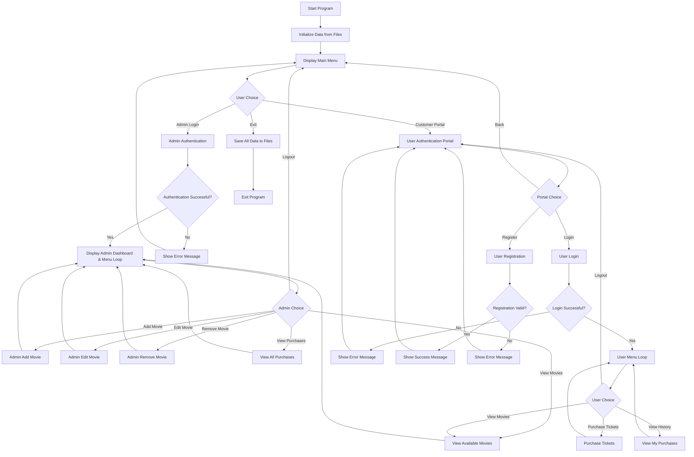
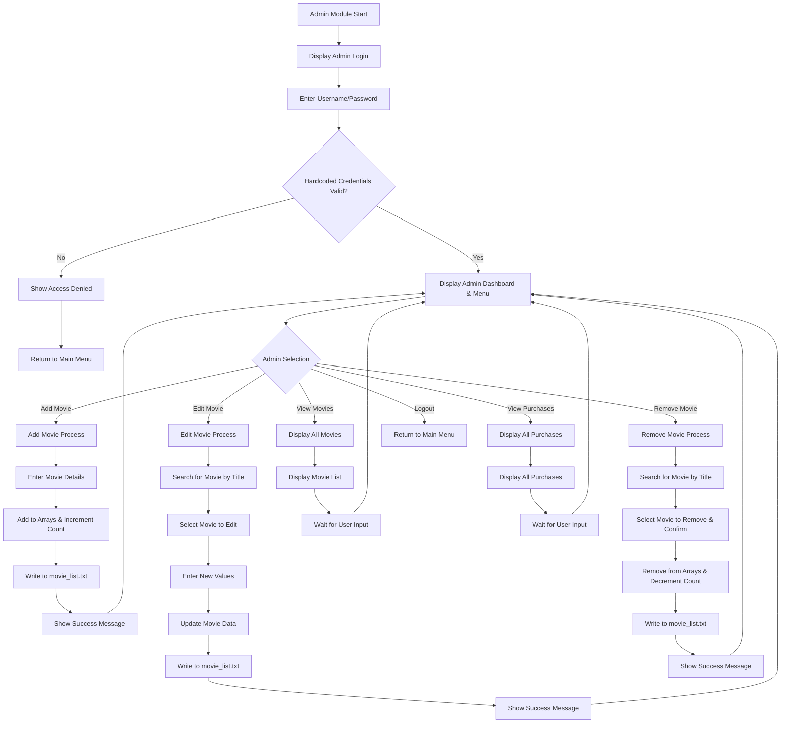
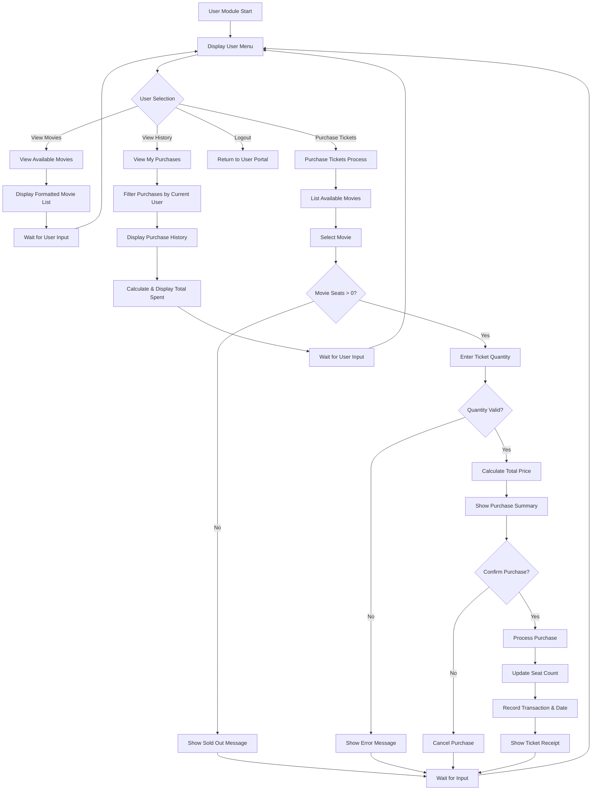
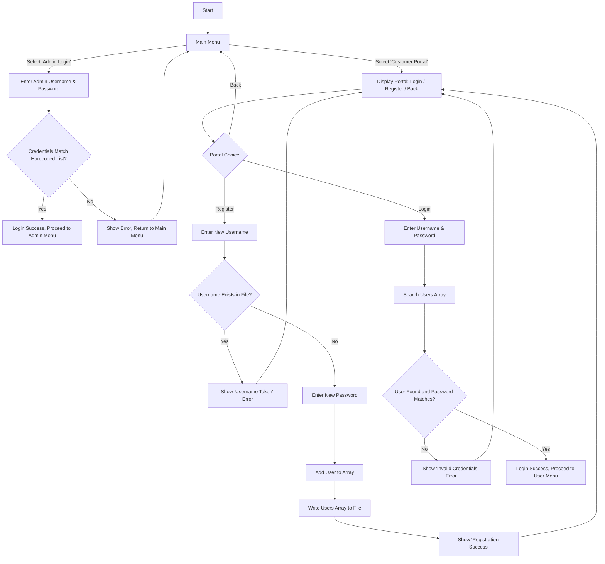
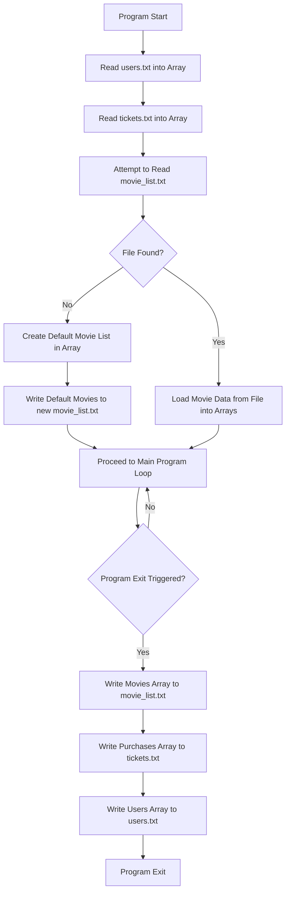

---

# JHS-CinePlex Documentation
## JHS-CinePlex Movie Ticket Booking System
### CSE115 Semester Final Project Documentation

## Table of Contents

- Project Overview
- System Architecture
- Data Structures
- Function Documentation
- Program Flowcharts
- File I/O and Data Persistence
- Navigating the System: Screen by Screen
- Limitations and Future Improvements
- Development Notes
- Conclusion

## Project Overview
### Introduction

JHS-CinePlex is a comprehensive Command Line Interface (CLI)-based movie ticket booking system developed in C. This system provides a complete solution for cinema management, allowing administrators to manage movies and showtimes while customers can browse available movies, purchase tickets, and view their purchase history. It features a visually enhanced interface with colors, formatted tables, and an administrative dashboard for a professional and user-friendly experience.

### System Objectives

- Provide a user-friendly and visually appealing interface for both administrators and customers.
- Enable efficient movie management (add, edit, remove) with substring search capabilities.
- Facilitate secure user authentication and registration.
- Streamline the ticket purchasing process with clear receipts.
- Maintain persistent data storage for movies, users, and transactions.
- Generate sales reports and track purchase history.

### Key Features

- **Dual Role System:** Administrator and Customer access levels with distinct functionalities.
- **Admin Dashboard:** A summary view for administrators showing total movies, tickets sold, revenue, and recent purchases.
- **User Management:** Robust registration and login functionality for customers.
- **Advanced Movie Management:** Add, edit, and remove movies. Editing and removing is made easy with a case-insensitive substring search.
- **Enhanced Visual Interface:** Features styled headers, color-coded feedback (success, error, info), and aligned tables for improved readability.
- **Ticket Booking:** Browse movies, check seat availability (color-coded), purchase tickets, and receive a formatted on-screen receipt.
- **Purchase History:** Track individual and all system-wide purchases in a clean, tabular format.
- **Data Persistence:** Automatically saves and loads all data (movies, users, purchases) from text files.
- **Default Data:** Pre-populated with sample movies for immediate demonstration.

### Technology Stack

- **Language:** C (Standard C)
- **Platform:** Primarily designed for Windows (`cls` command) but easily adaptable for Linux/macOS.
- **Data Storage:** Text files (`movie_list.txt`, `tickets.txt`, `users.txt`).
- **Libraries:** Standard C libraries (`stdio.h`, `stdlib.h`, `string.h`, `ctype.h`, `time.h`).

## System Architecture
### Overall System Design

The system follows a modular architecture with clear separation of concerns:

### Module Breakdown
1.  **Main Module**
    - Entry point of the application (`main`).
    - Handles main menu navigation.
    - Coordinates between admin and user modules.
    - Manages program termination and data saving.

2.  **Administrator Module**
    - Authentication for admin users (hardcoded credentials).
    - Displays an overview dashboard.
    - Advanced movie management operations (add, edit, remove with search).
    - Purchase report generation (view all purchases).

3.  **User Module**
    - Customer authentication (login) and registration.
    - Movie browsing and ticket purchasing.
    - Personal purchase history viewing.

4.  **Data Persistence Module**
    - File I/O operations for all data types.
    - Data serialization and deserialization from/to text files.
    - Default data initialization if data files are not found.

5.  **UI/Utility Module**
    - A collection of helper functions for clearing the screen, pausing, and printing formatted/colored output (headers, success/error messages).

## Data Structures
### Core Data Structures
#### 1. Movie Structure
```c
typedef struct {
    char title[200];
    char genre[100];
} Movie;
```
**Purpose:** Stores basic movie information including title and genre classification.

#### 2. Showtime Structure
```c
typedef struct {
    char time[100];
    int price;
    int available_Seats;
} Showtime;
```
**Purpose:** Manages scheduling, pricing, and availability information for each movie.

#### 3. Ticket Structure
```c
typedef struct {
    char movie_Title[200];
    char show_Time[50];
    int ticket_Count;
    int total_Amount;
    char username[50];
    char purchase_Date[20];
} Ticket;
```
**Purpose:** Records individual ticket purchases with complete transaction details, including the purchaser and date.

#### 4. User Structure
```c
typedef struct {
    char username[50];
    char password[50];
} User;
```
**Purpose:** Stores user authentication credentials.

### Global Variables
#### Data Arrays & Constants
```c
#define MAX_MOVIES 200
#define MAX_PURCHASES 500
#define MAX_USERS 200

Movie m[MAX_MOVIES];
Showtime s[MAX_MOVIES];
Ticket all_purchases[MAX_PURCHASES];
User all_users[MAX_USERS];
```

#### Counters
```c
int movie_count = 0;
int purchase_count = 0;
int user_count = 0;
```

### Data Relationships
The system maintains parallel arrays where the index `i` correlates related data:
- `m[i]` and `s[i]` represent the same movie's information and its corresponding showtime details.
- `all_purchases[i]` stores individual purchase records.
- `all_users[i]` contains user account information.

## Function Documentation
### Main Functions
#### `main()`
- **Purpose:** Entry point and main program loop.
- **Functionality:** Initializes data by reading from files, displays the main menu, routes to admin/user portals, and saves all data before exiting.

### Administrator Functions
#### `admin_panel()`
- **Purpose:** Handles administrator authentication and provides access to the admin menu.
- **Functionality:** Prompts for admin credentials. If valid, it enters a loop showing the admin dashboard and menu, handling all admin-related tasks.

#### `show_admin_dashboard()`
- **Purpose:** Displays a summary dashboard for the administrator.
- **Functionality:** Calculates and displays total movies, tickets sold, total revenue, and lists the 5 most recent purchases.

#### `admin_add_movie()`
- **Purpose:** Adds a new movie to the system.
- **Functionality:** Prompts for all movie details, adds them to the arrays, increments `movie_count`, and saves the updated data.

#### `admin_edit_movie()`
- **Purpose:** Modifies an existing movie's information using a search.
- **Functionality:** Prompts for a search term, finds the movie using `find_movie_by_title_substr`, and allows the admin to update any field.

#### `admin_remove_movie()`
- **Purpose:** Removes a movie from the system using a search.
- **Functionality:** Prompts for a search term, finds the movie, asks for confirmation, and removes it by shifting array elements.

#### `view_all_purchases()`
- **Purpose:** Displays a complete history of all purchases made in the system.
- **Functionality:** Shows all ticket purchases in a formatted table including ID, date, title, tickets, amount, and username.

### User Functions
#### `user_portal()`
- **Purpose:** The main entry point for customers.
- **Functionality:** Displays a menu with options to Login, Register, or go Back.

#### `user_login(char* username_buffer)`
- **Purpose:** Authenticates a customer's credentials.
- **Returns:** `int` (1 for success, 0 for failure).

#### `user_register()`
- **Purpose:** Registers a new customer account.
- **Functionality:** Prompts for a new username/password, checks for duplicates, and saves the new user.

#### `user_menu(const char* username)`
- **Purpose:** Displays the main menu for a logged-in customer.
- **Functionality:** Provides options to View Movies, Purchase Tickets, View My Purchases, or Logout.

#### `view_available_movies()`
- **Purpose:** Displays all movies available for booking.
- **Functionality:** Shows a formatted table of all movies with color-coded seat availability.

#### `purchase_tickets(const char* username)`
- **Purpose:** Guides a user through the ticket purchasing process.
- **Functionality:** Handles movie selection, validates ticket quantity, confirms the purchase, updates data, and prints a formatted receipt.

#### `view_my_purchases(const char* username)`
- **Purpose:** Displays the purchase history for the currently logged-in user.
- **Functionality:** Filters purchases by the user and displays their history and total spending.

### Data Persistence Functions
#### `Read_Movies()`, `Write_Movies()`
- **Purpose:** Load/save movie and showtime data from/to `movie_list.txt`.
- **Functionality:** `Read_Movies()` loads data at startup. If the file is missing, it calls `Default_Movies()` and creates the file. `Write_Movies()` saves the current movie data.

#### `Read_Tickets()`, `Write_Tickets()`
- **Purpose:** Load/save ticket purchase data from/to `tickets.txt`.

#### `Read_Users()`, `Write_Users()`
- **Purpose:** Load/save user account data from/to `users.txt`.

#### `Default_Movies()`
- **Purpose:** Initializes the system with default movies if `movie_list.txt` is not found.

### Utility Functions
- **UI Helpers:** `print_header()`, `print_success()`, `print_error()`, `print_info()` provide formatted, colored console output. `clear_screen()` and `press_enter_to_continue()` manage screen flow.
- **Input Helpers:** `get_menu_choice()` safely reads an integer choice. `confirm_prompt()` gets a Y/N answer.
- **Logic Helpers:** `find_movie_by_title_substr()` performs a case-insensitive search for a movie title substring, returning its index or -1 if not found.

---

## Program Flowcharts

These flowcharts provide a detailed visual representation of the program's logic, from the main application loop to the specific logic within each module.

### 1. Main Program Flow
This chart illustrates the high-level structure of the application, including initialization, the main menu loop, and the shutdown procedure.


### 2. Administrator Module Flow
This chart details the entire workflow for an administrator, from login to performing various management tasks like adding, editing, and removing movies.


### 3. User Module Flow
This diagram maps out the experience for a logged-in customer, detailing the process for viewing movies, viewing personal history, and the comprehensive, multi-step process of purchasing tickets.


### 4. Authentication Flow
This chart focuses on the `user_portal`, showing how a customer can navigate between the login and registration screens, and the logic that validates their actions.


### 5. Data Persistence Flow
This chart visualizes how the program interacts with the file system at the start and end of its execution, including the special case of creating default data if the movie file is missing.


## File I/O and Data Persistence

The system relies on three separate text files to persist data across sessions. All files are read upon startup and written to upon program exit or when critical data is changed (e.g., adding a movie).

#### 1. `movie_list.txt`
- **Format:** 5 lines per movie.
- **Content:** Title, Genre, Showtime, Price, Available Seats.

#### 2. `tickets.txt`
- **Format:** 6 lines per purchase.
- **Content:** Movie Title, Showtime, Ticket Count, Total Amount, Username, Purchase Date.

#### 3. `users.txt`
- **Format:** 1 line per user.
- **Content:** `username password` (space-separated).

### Data Integrity Measures
- **File Existence Check:** When reading `movie_list.txt`, if the file does not exist, the system populates itself with default movies and creates the file, ensuring the application can always run. Other read functions simply return if the file is missing.
- **Safe Reading:** `fgets` is used to read lines, preventing buffer overflows. `sscanf` is used to parse numbers and strings safely from buffers.
- **Data Synchronization:** Data is written back to files immediately after a state change (e.g., after adding a movie, registering a user, or purchasing a ticket) and also as a final step before the program exits, ensuring data consistency.

## Navigating the System: Screen by Screen

This section provides a complete, screen-by-screen walkthrough of the entire application.

---
### 1. Main Menu
This is the application's entry point.
**Screen:**
```
================================================================================
                      JHS-CinePlex - Management & Booking
================================================================================
   [1] Admin Login
   [2] Customer Login / Register
   [3] Exit

>> Enter your choice: 
```
**Interaction:**
- Enter `1` to proceed to Admin Login.
- Enter `2` to go to the Customer Portal.
- Enter `3` to save all data and exit the program.

---
### 2. Admin Login
**Screen:**
```
================================================================================
                                 Admin Login
================================================================================

Enter Admin Username: Hasib
Enter Admin Password: hasib123
```
**Interaction:** Enter one of the hardcoded admin usernames and its corresponding password.
**Possible Outcomes:**
- **Success:** `[SUCCESS] Login successful.` is displayed, and you proceed to the Admin Dashboard.
- **Failure:** `[ERROR] Incorrect username or password. Access denied.` is displayed, and you are returned to the Main Menu.

---
### 3. Admin Dashboard and Menu
The central hub for all administrative tasks.
**Screen:**
```
================================================================================
                                Admin Dashboard
================================================================================
  Total Movies:   5
  Tickets Sold:   2
  Total Revenue:  BDT 900

  Recent Purchases:
   2024-05-21 | The Notebook         |  1 tickets | 200 by jane_doe
   2024-05-21 | Hereditary           |  2 tickets | 400 by john_doe

   [1] Add New Movie
   [2] Edit Movie
   [3] Remove Movie
   [4] View All Movies
   [5] View All Purchases
   [6] Logout

>> Enter your choice: 
```
**Interaction:** View the dashboard summary and then enter a number to select a management task.

---
### 4. Admin: Add New Movie
**Screen:**
```
================================================================================
                              [+] Add New Movie
================================================================================
Enter Title (0 to cancel): Oppenheimer
Enter Genre: Biography/Drama
Enter Showtime (e.g., 08:00 PM - 10:00 PM): 07:00 PM - 10:00 PM
Enter Price: 600
Enter Available Seats: 150
```
**Interaction:** Enter the details for the new movie one by one.
**Outcome:** `[SUCCESS] Movie added successfully!` is displayed, and you return to the Admin Dashboard.

---
### 5. Admin: Edit Movie
A two-step process: search then edit.
**Screen (Step 1: Search):**
```
================================================================================
                                 ~ Edit Movie
================================================================================
Enter a title (or part) to search (0 to cancel): potter
```
**Screen (Step 2: Edit):**
```
Found: Harry Potter and the Goblet of Fire (Fantasy)
Showtime: 05:00 PM - 08:00 PM | Price: 500 | Seats: 0

Press Enter to keep current value.
New Title: 
New Genre: Fantasy/Adventure
New Showtime: 
New Price: 550
New Seats: 100
```
**Interaction:** First, enter a part of a movie title. If found, its details are displayed. You can then type a new value for any field or press Enter to skip it.
**Outcome:** `[SUCCESS] Movie updated.` is displayed. If the movie is not found, `[ERROR] Movie not found.` is shown.

---
### 6. Admin: Remove Movie
A two-step process: search then confirm.
**Screen:**
```
================================================================================
                               [-] Remove Movie
================================================================================
Enter a title (or part) to search (0 to cancel): baby

Found: Boss Baby (Family / Comedy) - Seats: 50 - Price: 200
Confirm removal? (Y/N): Y
```
**Interaction:** Search for the movie. If found, confirm its removal by typing `Y` and pressing Enter.
**Possible Outcomes:**
- **Success:** `[SUCCESS] Movie removed.` is displayed.
- **Cancelled:** `[INFO] Removal cancelled.` is displayed if you enter `N`.
- **Not Found:** `[ERROR] Movie not found.` is displayed.

---
### 7. Admin: View All Purchases
**Screen:**
```
================================================================================
                             All Purchase History
================================================================================
ID    Date         Movie                Tickets  Amount   User      
---------------------------------------------------------------------
#1    2024-05-21   Hereditary           2        400      john_doe  
#2    2024-05-21   The Notebook         1        200      jane_doe  
```
**Interaction:** This is a view-only screen. Press Enter to return to the Admin Dashboard.

---
### 8. Customer Portal
The entry point for customers.
**Screen:**
```
================================================================================
                                Customer Portal
================================================================================
   [1] Login
   [2] Register
   [3] Back

>> Enter your choice: 
```
**Interaction:** `1` for Login, `2` for Register, `3` to return to the Main Menu.

---
### 9. Customer Registration
**Screen:**
```
================================================================================
                           New User Registration
================================================================================

Enter a new username (0 to cancel): new_user
Enter a new password: new_password123
```
**Possible Outcomes:**
- **Success:** `[SUCCESS] Registration successful! You can now log in.` is shown.
- **Username Exists:** `[ERROR] Username already exists.` is shown.
- **Cancelled:** Entering `0` for the username returns you to the Customer Portal.

---
### 10. Customer Login
**Screen:**
```
================================================================================
                                Customer Login
================================================================================

Enter Username: new_user
Enter Password: new_password123
```
**Possible Outcomes:**
- **Success:** `[SUCCESS] Login successful!` is shown, and you proceed to the Customer Menu.
- **Failure:** `[ERROR] Invalid username or password.` is shown, and you return to the Customer Portal.

---
### 11. Customer Menu
The main dashboard for a logged-in customer.
**Screen:**
```
================================================================================
                              Welcome, new_user!
================================================================================
   [1] View Available Movies
   [2] Purchase Tickets
   [3] View My Purchases
   [4] Logout

>> Enter your choice: 
```
**Interaction:** Enter a number corresponding to your desired action.

---
### 12. Customer: View Available Movies
**Screen:**
```
================================================================================
                               Available Movies
================================================================================
No.  Title                          Genre              Price    Seats   
----------------------------------------------------------------------------
1    Hereditary                     Horror             200      50      
2    The Notebook                   Romantic           200      10      
3    Boss Baby                      Family / Comedy    200      50      
4    Harry Potter and the Goblet... Fantasy            500      SOLD OUT
...
```
**Interaction:** View-only screen showing all movies. Seat availability is color-coded. Press Enter to return to the Customer Menu.

---
### 13. Customer: Purchase Tickets
A multi-step process.
**Screen (Step 1: Select Movie):**
```
================================================================================
                               Purchase Tickets
================================================================================
   [1] Hereditary (Horror) - Seats: 50
   [2] The Notebook (Romantic) - Seats: 10
   ...
   [0] Back

>> Enter movie number: 1
```
**Screen (Step 2: Enter Quantity & Confirm):**
```
Selected: 'Hereditary' | Available Seats: 50
>> Enter number of tickets to buy: 2

--- Purchase Summary ---
   Movie:   Hereditary
   Showtime:11:00 PM - 01:20 AM
   Tickets: 2
   Total:   BDT 400
------------------------
Confirm purchase? (Y/N): Y
```
**Screen (Step 3: Receipt):**
```
================================================================================
                                Ticket Receipt
================================================================================
+-----------------------------------------------+
|            JHS-CinePlex Ticket                |
+-----------------------------------------------+
  Movie: Hereditary                             
  Show : 11:00 PM - 01:20 AM                    
  Seats: 2                                      
  Total: BDT 400                                
  Date : 2024-05-21                             
+-----------------------------------------------+
[SUCCESS] Purchase successful!
```
**Possible Outcomes:**
- **Success:** The receipt is shown.
- **Cancelled:** `[INFO] Purchase cancelled.` is shown if you enter `N`.
- **Invalid Quantity:** `[ERROR] Invalid ticket count.` is shown if the number is zero, negative, or more than available seats.
- **Sold Out:** `[ERROR] Sorry, this movie is SOLD OUT.` is shown if you select a sold-out movie.

---
### 14. Customer: View My Purchases
**Screen (With History):**
```
================================================================================
                        Purchase History for new_user
================================================================================
Date         Movie Title                    Tickets  Amount   
---------------------------------------------------------------
2024-05-21   Hereditary                     2        400      
---------------------------------------------------------------
Total Spent: BDT 400
```
**Screen (No History):**
```
...
---------------------------------------------------------------
[INFO] You have not made any purchases yet.
```
**Interaction:** View your personal purchase history. Press Enter to return to the Customer Menu.

## Limitations and Future Improvements
### Current Limitations
- **Security:** Passwords are stored in plaintext in `users.txt`. Admin credentials are hardcoded in the source.
- **Data Management:** Uses fixed-size arrays (`200` movies, `500` purchases, `200` users), which could overflow. Data is managed in memory, which is not suitable for very large datasets.
- **Concurrency:** The system is single-user and does not support simultaneous operations.
- **User Interface:** The `clear_screen()` function uses `system("cls")`, making it specific to Windows. While admins can search movies to edit/remove, customers cannot search or filter the movie list.
- **Business Logic:** No support for seat selection (only a counter), promo codes, or ticket cancellations/refunds.

### Future Improvements
- **Security:** Implement password hashing (e.g., using a library like OpenSSL for SHA-256 or a dedicated library for Argon2/bcrypt). Admin credentials could be moved to a configuration file.
- **Data Management:**
    - Replace fixed-size arrays with dynamically allocated memory (`malloc`, `realloc`) for scalability.
    - Migrate from flat text files to a lightweight database like **SQLite** for more robust, efficient, and scalable data handling. This would also eliminate linear searches.
- **User Interface:**
    - Add cross-platform screen clearing (e.g., using a preprocessor directive: `#ifdef _WIN32 ... #else ... #endif`).
    - Implement search and filtering capabilities for customers (e.g., filter by genre, search by title).
- **Business Logic:**
    - Implement a seat map for visual seat selection (e.g., a 2D array representing seats).
    - Add a system for discount codes and promotions.
    - Introduce functionality for users to cancel their bookings within a certain timeframe.
- **Performance:** For file-based storage, implement more efficient search algorithms (like binary search on a sorted list) instead of linear scans to improve performance as the data grows.
- **Advanced Features:** Add features like email notifications for ticket purchases, a reporting system for admins (e.g., revenue by movie), and user roles/permissions.

## Development Notes
### Code Organization
The code is currently in a single C file. For future development, it should be split into multiple files for better organization:
- `main.c`: Core program loop.
- `admin.c`/`admin.h`: Functions related to the admin panel.
- `user.c`/`user.h`: Functions for the customer portal.
- `database.c`/`database.h`: All file I/O and data persistence logic.
- `utils.c`/`utils.h`: Helper functions for UI, input, etc.

### Coding Standards
- **Naming Conventions:** The code uses a mix of styles. A consistent style should be enforced, for example: `snake_case_for_functions_and_vars`, `PascalCaseForStructs`, `UPPER_CASE_FOR_CONSTANTS`.
- **UI and Visuals:** The system leverages ANSI escape codes for color, providing clear visual feedback. The layout is standardized with headers and consistent prompts, creating a professional CLI experience. Tabular data is formatted for readability.
- **Comments:** The code includes comments to explain the purpose of functions and complex logic blocks. For future work, Doxygen-style comments would be beneficial for automatic documentation generation.

## Conclusion
This documentation provides a complete and comprehensive overview of the JHS-CinePlex system. The project successfully implements a dual-role movie booking application in C, featuring a robust, user-friendly CLI with enhanced visuals and persistent data storage. It demonstrates strong programming fundamentals, modular design, and a clear focus on user experience. The outlined limitations and future improvements provide a clear roadmap for further development, making it an excellent foundation for a more advanced, production-ready application.

---
*Documentation generated for JHS-CinePlex Movie Ticket Booking System*  
*CSE115 Semester Final Project*
