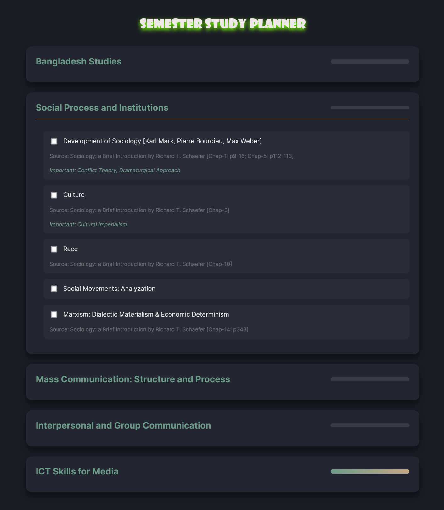

# Semester Study Planner

 <!-- Add a screenshot later -->

A comprehensive and interactive study planner web application designed to help students organize their semester studies effectively. This planner includes course topics, subtopics, source references, and progress tracking.

## Features

- **Course Organization**: Five main courses with detailed topics and subtopics
- **Progress Tracking**: Visual progress bars for each course
- **Persistent Storage**: Saves progress using localStorage
- **Responsive Design**: Works on all screen sizes
- **Interactive Interface**: 
  - Expandable/collapsible topics
  - Checkbox system for tracking completed topics
- **Resource Management**:
  - Source references for each topic
  - Important notes section
- **Visual Feedback**:
  - Progress bars update in real-time
  - Smooth animations and hover effects

## Technologies Used

- **Frontend**:
  - HTML5
  - CSS3 (with CSS Variables)
  - JavaScript (ES6)
- **Libraries**:
  - Font Awesome (v5) for icons
  - Google Fonts (Inter and Playfair Display)
- **Browser Features**:
  - localStorage for persistent data
  - CSS transitions and animations

## Installation

No installation required! This is a pure frontend application that runs directly in the browser.

1. Clone the repository:
   ```bash
   git clone https://github.com/your-username/semester-study-planner.git
