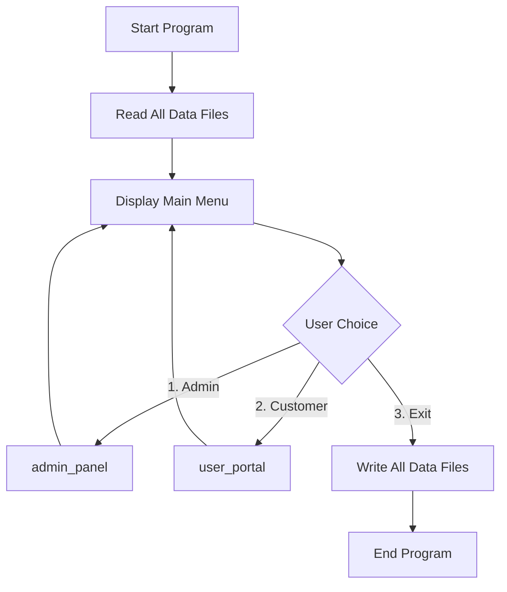
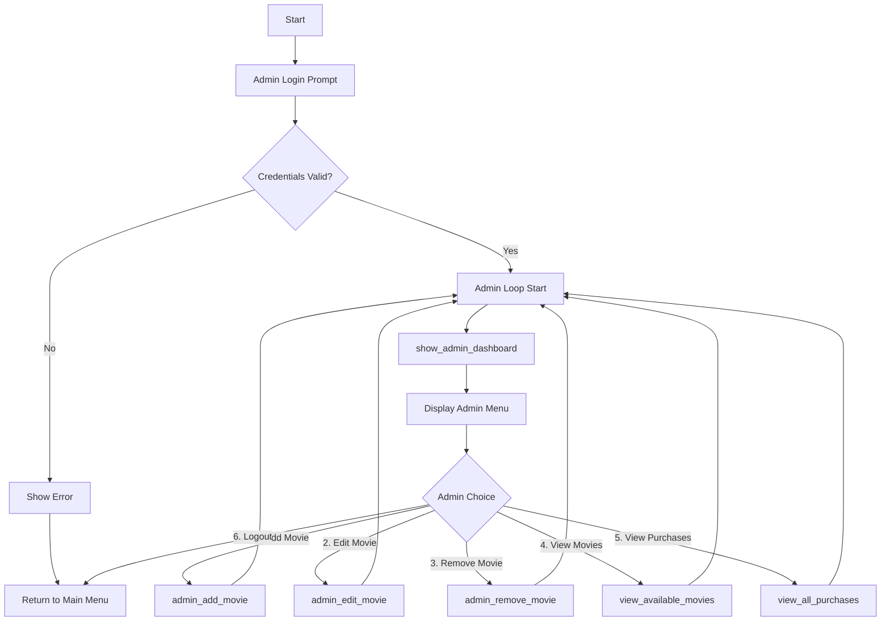
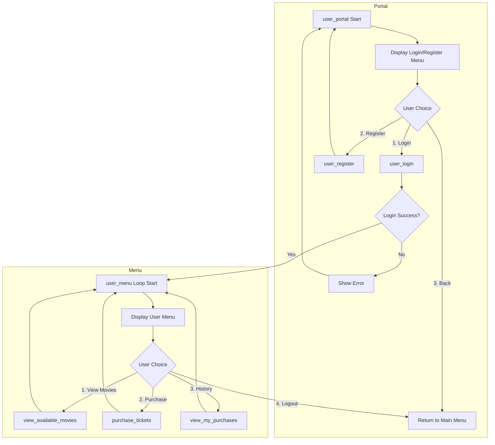

---
# JHS-CinePlex Documentation
## JHS-CinePlex Movie Ticket Booking System
### CSE115 Semester Final Project Documentation

## Table of Contents

- Project Overview
- System Architecture
- Data Structures
- Function Documentation
- Program Flowcharts
- File I/O and Data Persistence
- User Guide & Administrator Guide
- Navigating the System: Screen by Screen
- Limitations and Future Improvements
- Development Notes

## Project Overview
### Introduction

JHS-CinePlex is a comprehensive Command Line Interface (CLI)-based movie ticket booking system developed in C. This system provides a complete solution for cinema management, allowing administrators to manage movies and showtimes while customers can browse available movies, purchase tickets, and view their purchase history. It features a visually enhanced interface with colors, formatted tables, and an administrative dashboard for a professional and user-friendly experience.

### System Objectives

- Provide a user-friendly and visually appealing interface for both administrators and customers.
- Enable efficient movie management (add, edit, remove) with substring search capabilities.
- Facilitate secure user authentication and registration.
- Streamline the ticket purchasing process with clear receipts.
- Maintain persistent data storage for movies, users, and transactions.
- Generate sales reports and track purchase history.

### Key Features

- **Dual Role System:** Administrator and Customer access levels with distinct functionalities.
- **Admin Dashboard:** A summary view for administrators showing total movies, tickets sold, revenue, and recent purchases.
- **User Management:** Robust registration and login functionality for customers.
- **Advanced Movie Management:** Add, edit, and remove movies. Editing and removing is made easy with a case-insensitive substring search.
- **Enhanced Visual Interface:** Features styled headers, color-coded feedback (success, error, info), and aligned tables for improved readability.
- **Ticket Booking:** Browse movies, check seat availability (color-coded), purchase tickets, and receive a formatted on-screen receipt.
- **Purchase History:** Track individual and all system-wide purchases in a clean, tabular format.
- **Data Persistence:** Automatically saves and loads all data (movies, users, purchases) from text files.
- **Default Data:** Pre-populated with sample movies for immediate demonstration.

### Technology Stack

- **Language:** C (Standard C)
- **Platform:** Primarily designed for Windows (`cls` command) but easily adaptable for Linux/macOS.
- **Data Storage:** Text files (`movie_list.txt`, `tickets.txt`, `users.txt`).
- **Libraries:** Standard C libraries (`stdio.h`, `stdlib.h`, `string.h`, `ctype.h`, `time.h`).

## System Architecture
### Overall System Design

The system follows a modular architecture with clear separation of concerns:

### Module Breakdown
1.  **Main Module**
    - Entry point of the application (`main`).
    - Handles main menu navigation.
    - Coordinates between admin and user modules.
    - Manages program termination and data saving.

2.  **Administrator Module**
    - Authentication for admin users (hardcoded credentials).
    - Displays an overview dashboard.
    - Advanced movie management operations (add, edit, remove with search).
    - Purchase report generation (view all purchases).

3.  **User Module**
    - Customer authentication (login) and registration.
    - Movie browsing and ticket purchasing.
    - Personal purchase history viewing.

4.  **Data Persistence Module**
    - File I/O operations for all data types.
    - Data serialization and deserialization from/to text files.
- Default data initialization if data files are not found.
    - Error handling for file operations.

5.  **UI/Utility Module**
    - A collection of helper functions for clearing the screen, pausing, and printing formatted/colored output (headers, success/error messages).

## Data Structures
### Core Data Structures
#### 1. Movie Structure
```c
typedef struct {
    char title[200];
    char genre[100];
} Movie;
```
**Purpose:** Stores basic movie information including title and genre classification.

#### 2. Showtime Structure
```c
typedef struct {
    char time[100];
    int price;
    int available_Seats;
} Showtime;
```
**Purpose:** Manages scheduling, pricing, and availability information for each movie.

#### 3. Ticket Structure
```c
typedef struct {
    char movie_Title[200];
    char show_Time[50];
    int ticket_Count;
    int total_Amount;
    char username[50];
    char purchase_Date[20];
} Ticket;
```
**Purpose:** Records individual ticket purchases with complete transaction details, including the purchaser and date.

#### 4. User Structure
```c
typedef struct {
    char username[50];
    char password[50];
} User;
```
**Purpose:** Stores user authentication credentials.

### Global Variables
#### Data Arrays
```c
Movie m[MAX_MOVIES];                 // Array of movies (MAX_MOVIES = 200)
Showtime s[MAX_MOVIES];              // Array of showtimes
Ticket all_purchases[MAX_PURCHASES]; // Array of all ticket purchases (MAX_PURCHASES = 500)
User all_users[MAX_USERS];           // Array of registered users (MAX_USERS = 200)
```

#### Counters
```c
int movie_count = 0;    // Number of movies in system
int purchase_count = 0; // Number of ticket purchases
int user_count = 0;     // Number of registered users
```

### Data Relationships
The system maintains parallel arrays where the index `i` correlates related data:
- `m[i]` and `s[i]` represent the same movie's information and its corresponding showtime details.
- `all_purchases[i]` stores individual purchase records.
- `all_users[i]` contains user account information.

## Function Documentation
### Main Functions
#### `main()`
- **Purpose:** Entry point and main program loop.
- **Parameters:** None.
- **Returns:** `int` (0 on successful exit).
- **Functionality:**
    - Initializes data by calling `Read_Users()`, `Read_Movies()`, and `Read_Tickets()`.
    - Displays the main menu with options for admin login, user portal, or exit.
    - Routes to `admin_panel()` or `user_portal()` based on user choice.
    - Calls `Write_Movies()`, `Write_Tickets()`, and `Write_Users()` to save all data before program termination.

### Administrator Functions
#### `admin_panel()`
- **Purpose:** Handles administrator authentication and provides access to the admin menu.
- **Parameters:** None.
- **Returns:** `void`.
- **Functionality:**
    - Prompts for admin username and password.
    - Validates credentials against hardcoded admin accounts (`Hasib`, `Jaima`, `Shimu`).
    - Upon successful login, it enters a loop that first displays the `show_admin_dashboard()` and then the admin menu.
    - Handles routing to various admin functions based on choice.

#### `show_admin_dashboard()`
- **Purpose:** Displays a summary dashboard for the administrator.
- **Parameters:** None.
- **Returns:** `void`.
- **Functionality:**
    - Calculates and displays total movies, total tickets sold, and total revenue.
    - Shows a list of the 5 most recent purchases.

#### `admin_add_movie()`
- **Purpose:** Adds a new movie to the system.
- **Parameters:** None.
- **Returns:** `void`.
- **Functionality:**
    - Prompts for movie details (title, genre, showtime, price, seats).
    - Adds the new movie and showtime to their respective arrays.
    - Increments `movie_count` and saves the updated movie list to file.

#### `admin_edit_movie()`
- **Purpose:** Modifies an existing movie's information.
- **Parameters:** None.
- **Returns:** `void`.
- **Functionality:**
    - Prompts the admin for a search query (part of a movie title).
    - Uses `find_movie_by_title_substr()` to locate the movie.
    - Displays the movie's current details and allows the admin to enter new values for any field.
    - Pressing Enter without typing keeps the current value.
    - Saves changes to the movie list file.

#### `admin_remove_movie()`
- **Purpose:** Removes a movie from the system.
- **Parameters:** None.
- **Returns:** `void`.
- **Functionality:**
    - Prompts for a search query and uses `find_movie_by_title_substr()` to find the movie.
    - Asks for confirmation before deleting.
    - Removes the movie and showtime by shifting subsequent elements in the arrays.
    - Decrements `movie_count` and saves the changes.

#### `view_all_purchases()`
- **Purpose:** Displays a complete history of all purchases made in the system.
- **Parameters:** None.
- **Returns:** `void`.
- **Functionality:**
    - Shows all ticket purchases in a formatted table including ID, date, title, ticket count, amount, and username.

### User Functions
#### `user_portal()`
- **Purpose:** The main entry point for customers.
- **Parameters:** None.
- **Returns:** `void`.
- **Functionality:**
    - Displays a menu with options to Login, Register, or go Back.
    - Routes the user to `user_login()` or `user_register()`.

#### `user_login(char* username_buffer)`
- **Purpose:** Authenticates a customer's credentials.
- **Parameters:**
    - `username_buffer`: A character buffer to store the username upon successful login.
- **Returns:** `int` (1 for success, 0 for failure).
- **Functionality:**
    - Prompts for username and password.
    - Verifies credentials against the `all_users` array.

#### `user_register()`
- **Purpose:** Registers a new customer account.
- **Parameters:** None.
- **Returns:** `void`.
- **Functionality:**
    - Prompts for a new username and password.
    - Checks for duplicate usernames to ensure uniqueness.
    - Adds the new user to the `all_users` array and saves the updated user list.

#### `user_menu(const char* username)`
- **Purpose:** Displays the main menu for a logged-in customer.
- **Parameters:**
    - `username`: The username of the currently logged-in customer.
- **Returns:** `void`.
- **Functionality:**
    - Displays a personalized welcome message.
    - Provides options to View Available Movies, Purchase Tickets, View My Purchases, or Logout.

#### `view_available_movies()`
- **Purpose:** Displays all movies available for booking.
- **Parameters:** None.
- **Returns:** `void`.
- **Functionality:**
    - Shows a formatted table of all movies with title, genre, price, and seat availability.
    - Seat availability is color-coded: green for available seats, red for "SOLD OUT".

#### `purchase_tickets(const char* username)`
- **Purpose:** Guides a user through the ticket purchasing process.
- **Parameters:**
    - `username`: The username of the purchasing customer.
- **Returns:** `void`.
- **Functionality:**
    - Lists available movies for selection.
    - Prompts for the number of tickets.
    - Validates the request against available seats.
    - Shows a purchase summary and asks for confirmation.
    - On confirmation, it updates seat availability, records the transaction in `all_purchases`, and prints a formatted on-screen ticket receipt.

#### `view_my_purchases(const char* username)`
- **Purpose:** Displays the purchase history for the currently logged-in user.
- **Parameters:**
    - `username`: The username of the current user.
- **Returns:** `void`.
- **Functionality:**
    - Filters the `all_purchases` array by the provided username.
    - Displays a detailed purchase history and calculates the total amount spent.

### Data Persistence Functions
#### `Read_Movies() / Write_Movies()`
- **Purpose:** Load/save movie and showtime data from/to `movie_list.txt`.
- **Functionality:** `Read_Movies()` loads data at startup. If the file doesn't exist, it calls `Default_Movies()` to populate with sample data and then writes the file. `Write_Movies()` saves the current state of all movies to the file.

#### `Read_Tickets() / Write_Tickets()`
- **Purpose:** Load/save ticket purchase data from/to `tickets.txt`.
- **Functionality:** `Read_Tickets()` loads all historical purchases at startup. `Write_Tickets()` saves the full purchase history, including any new transactions, to the file.

#### `Read_Users() / Write_Users()`
- **Purpose:** Load/save user account data from/to `users.txt`.
- **Functionality:** `Read_Users()` loads all registered user accounts at startup. `Write_Users()` saves the current user list, including any new registrations, to the file.

#### `Default_Movies()`
- **Purpose:** Initializes the system with a set of default movies if `movie_list.txt` is not found.
- **Functionality:** Populates the `m` and `s` arrays with 5 sample movies to provide demonstration data.

### Utility Functions
#### `print_header(const char* title)`, `print_success()`, `print_error()`, `print_info()`
- **Purpose:** A set of functions to display formatted, colored output for a better user experience. They handle headers, success messages (green), error messages (red), and informational messages (yellow).

#### `clear_screen()`, `press_enter_to_continue()`
- **Purpose:** Helper functions for UI flow control. `clear_screen()` clears the console (using `system("cls")`). `press_enter_to_continue()` pauses the program until the user hits Enter.

#### `get_menu_choice()`, `confirm_prompt()`, `find_movie_by_title_substr()`
- **Purpose:** Input and logic helper functions. `get_menu_choice()` safely gets an integer menu choice from the user. `confirm_prompt()` gets a 'Y' or 'N' confirmation. `find_movie_by_title_substr()` performs a case-insensitive search for a movie and returns its index.

## Program Flowcharts

### Main Program Flow


### Administrator Module Flow (`admin_panel`)


### User Module Flow (`user_portal` & `user_menu`)


## File I/O and Data Persistence

### File Structure
The system uses three plain text files for data persistence.

#### 1. `movie_list.txt`
- **Format:** Each movie and its showtime occupy 5 consecutive lines.
    1.  Movie Title
    2.  Movie Genre
    3.  Showtime (e.g., `08:00 PM - 10:00 PM`)
    4.  Price (integer)
    5.  Available Seats (integer)

- **Example:**
```text
Hereditary
Horror
11:00 PM - 01:20 AM
200
50
The Notebook
Romantic
08:30 PM - 10:10 PM
200
10
```

#### 2. `tickets.txt`
- **Format:** Each ticket purchase occupies 6 consecutive lines.
    1.  Movie Title
    2.  Showtime
    3.  Ticket Count (integer)
    4.  Total Amount (integer)
    5.  Username of purchaser
    6.  Purchase Date (format: `YYYY-MM-DD`)

- **Example:**
```text
Hereditary
11:00 PM - 01:20 AM
2
400
john_doe
2024-05-21
```

#### 3. `users.txt`
- **Format:** Each user occupies 1 line with space-separated values: `username password`.

- **Example:**
```text
john_doe password123
jane_smith secure456
```

### File Operations
#### Reading Operations
**Movie Data Reading:**
```c
void Read_Movies() {
    FILE *file = fopen("movie_list.txt", "r");
    if (!file) { Default_Movies(); Write_Movies(); return; }
    char buffer[256];
    movie_count = 0;
    while(movie_count < MAX_MOVIES && fgets(m[movie_count].title, sizeof(m[0].title), file)) {
        strtok(m[movie_count].title, "\n");
        fgets(m[movie_count].genre, sizeof(m[0].genre), file); strtok(m[movie_count].genre, "\n");
        fgets(s[movie_count].time, sizeof(s[0].time), file); strtok(s[movie_count].time, "\n");
        fgets(buffer, sizeof(buffer), file); sscanf(buffer, "%d", &s[movie_count].price);
        fgets(buffer, sizeof(buffer), file); sscanf(buffer, "%d", &s[movie_count].available_Seats);
        movie_count++;
    }
    fclose(file);
}
```

**Ticket Data Reading:**
```c
void Read_Tickets() {
    FILE *file = fopen("tickets.txt", "r");
    if (!file) return;
    char buffer[512];
    purchase_count = 0;
    while (purchase_count < MAX_PURCHASES && fgets(all_purchases[purchase_count].movie_Title, sizeof(all_purchases[0].movie_Title), file)) {
        strtok(all_purchases[purchase_count].movie_Title, "\n");
        fgets(all_purchases[purchase_count].show_Time, sizeof(all_purchases[0].show_Time), file); strtok(all_purchases[purchase_count].show_Time, "\n");
        fgets(buffer, sizeof(buffer), file); sscanf(buffer, "%d", &all_purchases[purchase_count].ticket_Count);
        fgets(buffer, sizeof(buffer), file); sscanf(buffer, "%d", &all_purchases[purchase_count].total_Amount);
        fgets(all_purchases[purchase_count].username, sizeof(all_purchases[0].username), file); strtok(all_purchases[purchase_count].username, "\n");
        fgets(all_purchases[purchase_count].purchase_Date, sizeof(all_purchases[0].purchase_Date), file); strtok(all_purchases[purchase_count].purchase_Date, "\n");
        purchase_count++;
    }
    fclose(file);
}
```

**User Data Reading:**
```c
void Read_Users() {
    FILE *file = fopen("users.txt", "r");
    if (!file) return;
    char line[128];
    user_count = 0;
    while (user_count < MAX_USERS && fgets(line, sizeof(line), file)) {
        if (sscanf(line, "%49s %49s", all_users[user_count].username, all_users[user_count].password) == 2) {
            user_count++;
        }
    }
    fclose(file);
}
```

#### Writing Operations
**Movie Data Writing:**
```c
void Write_Movies() {
    FILE *file = fopen("movie_list.txt", "w");
    if (!file) return;
    for (int i = 0; i < movie_count; ++i) {
        fprintf(file, "%s\n%s\n%s\n%d\n%d\n", m[i].title, m[i].genre, s[i].time, s[i].price, s[i].available_Seats);
    }
    fclose(file);
}
```

## Navigating the System: Screen by Screen

This guide provides a walkthrough of the key screens in the JHS-CinePlex system.

---
### 1. Main Menu
The application's entry point.
```
================================================================================
                      JHS-CinePlex - Management & Booking
================================================================================
   [1] Admin Login
   [2] Customer Login / Register
   [3] Exit

>> Enter your choice:
```
**Interaction:** Enter `1` for Admin, `2` for Customer, `3` to save and exit.

---
### 2. Admin Login & Dashboard
After choosing Admin Login, you are prompted for credentials. On success, the dashboard is shown.
```
================================================================================
                                Admin Dashboard
================================================================================
  Total Movies:   5
  Tickets Sold:   2
  Total Revenue:  BDT 900

  Recent Purchases:
   (none yet)

   [1] Add New Movie
   [2] Edit Movie
   [3] Remove Movie
   ...
```
**Interaction:** View the stats, then select a management option.

---
### 3. Customer Portal
The entry point for customers to log in or create a new account.
```
================================================================================
                                Customer Portal
================================================================================
   [1] Login
   [2] Register
   [3] Back

>> Enter your choice:
```
**Interaction:** `1` to log in, `2` to register, `3` to go back.

---
### 4. Customer Menu
After a customer logs in, they see their personalized menu.
```
================================================================================
                               Welcome, Hasib!
================================================================================
   [1] View Available Movies
   [2] Purchase Tickets
   [3] View My Purchases
   [4] Logout

>> Enter your choice:
```
**Interaction:** Choose an action. `4` logs out and returns to the main menu.

---
### 5. View Available Movies
This screen displays all movies with color-coded seat availability.
```
================================================================================
                               Available Movies
================================================================================
No.  Title                          Genre              Price    Seats
----------------------------------------------------------------------------
1    Hereditary                     Horror             200      50
2    The Notebook                   Romantic           200      10
3    Boss Baby                      Family / Comedy    200      50
4    Harry Potter and the Goblet... Fantasy            500      SOLD OUT
...
```
**Interaction:** View-only. Press Enter to continue.

---
### 6. Purchase Tickets & Receipt
After selecting a movie and quantity, the user confirms the purchase and sees a receipt.
```
================================================================================
                                Ticket Receipt
================================================================================
+-----------------------------------------------+
|            JHS-CinePlex Ticket                |
+-----------------------------------------------+
  Movie: Hereditary
  Show : 11:00 PM - 01:20 AM
  Seats: 2
  Total: BDT 400
  Date : 2024-05-21
+-----------------------------------------------+
[SUCCESS] Purchase successful!

Press Enter to continue...
```
**Interaction:** Review the receipt, then press Enter to return to the user menu.

---
### 7. View Purchase History (Admin/User)
Both admins and users can view purchase histories. The admin view includes the username for each purchase.
```
================================================================================
                            All Purchase History
================================================================================
ID   Date         Movie                Tickets  Amount   User
---------------------------------------------------------------------
#1   2024-05-21   Hereditary           2        400      john_doe
#2   2024-05-20   The Notebook         1        200      jane_smith
```
**Interaction:** View-only. Press Enter to continue.

## Limitations and Future Improvements
### Current Limitations
- **Security:** Passwords are saved in plaintext in `users.txt`. Admin credentials are hardcoded in the source.
- **Data Management:** Uses fixed-size arrays (`200` movies, `500` purchases, `200` users), which could overflow. Data is managed in memory, which is not suitable for very large datasets.
- **Concurrency:** The system is single-user and does not support simultaneous operations.
- **User Interface:** The `clear_screen()` function uses `system("cls")`, making it specific to Windows. While admins can search movies to edit/remove, customers cannot search or filter the movie list.
- **Business Logic:** No support for seat selection (only a counter), promo codes, or ticket cancellations/refunds.

### Future Improvements
- **Security:** Implement password hashing (e.g., using a library like OpenSSL for SHA-256 or a dedicated library for Argon2/bcrypt). Admin credentials could be moved to a configuration file.
- **Data Management:**
    - Replace fixed-size arrays with dynamically allocated memory (`malloc`, `realloc`) for scalability.
    - Migrate from flat text files to a lightweight database like **SQLite** for more robust, efficient, and scalable data handling. This would also eliminate linear searches.
- **User Interface:**
    - Add cross-platform screen clearing.
    - Implement search and filtering capabilities for customers (e.g., filter by genre, search by title).
- **Business Logic:**
    - Implement a seat map for visual seat selection.
    - Add a system for discount codes and promotions.
    - Introduce functionality for users to cancel their bookings within a certain timeframe.
- **Performance:** For file-based storage, implement more efficient search algorithms (like binary search on a sorted list) instead of linear scans to improve performance as the data grows.
- **Advanced Features:** Add features like email notifications for ticket purchases, a reporting system for admins (e.g., revenue by movie), and user roles/permissions.

## Development Notes
### Code Organization
The code is currently in a single C file. For future development, it should be split into multiple files for better organization:
- `main.c`: Core program loop.
- `admin.c`/`admin.h`: Functions related to the admin panel.
- `user.c`/`user.h`: Functions for the customer portal.
- `database.c`/`database.h`: All file I/O and data persistence logic.
- `utils.c`/`utils.h`: Helper functions for UI, input, etc.

### Coding Standards
- **Naming Conventions:**
    - **Functions:** `snake_case` (e.g., `admin_add_movie`).
    - **Variables:** `camelCase` or `snake_case` for local variables (e.g., `ticket_count`).
    - **Structures:** `PascalCase` (e.g., `Movie`, `Showtime`).
    - **Constants:** `UPPER_CASE_WITH_UNDERSCORES` (e.g., `MAX_MOVIES`).
- **UI and Visuals:** The system leverages ANSI escape codes for color, providing clear visual feedback. The layout is standardized with headers and consistent prompts, creating a professional CLI experience. Tabular data is formatted for readability.
- **Comments:** The code includes comments to explain the purpose of functions and complex logic blocks.

## Conclusion
This documentation provides a comprehensive overview of the JHS-CinePlex system. The project successfully implements a dual-role movie booking application in C, featuring a robust, user-friendly CLI with enhanced visuals and persistent data storage. It demonstrates strong programming fundamentals, modular design, and a clear focus on user experience. The outlined limitations and future improvements provide a clear roadmap for further development, making it an excellent foundation for a more advanced, production-ready application.

---
*Documentation generated for JHS-CinePlex Movie Ticket Booking System*  
*CSE115 Semester Final Project*
